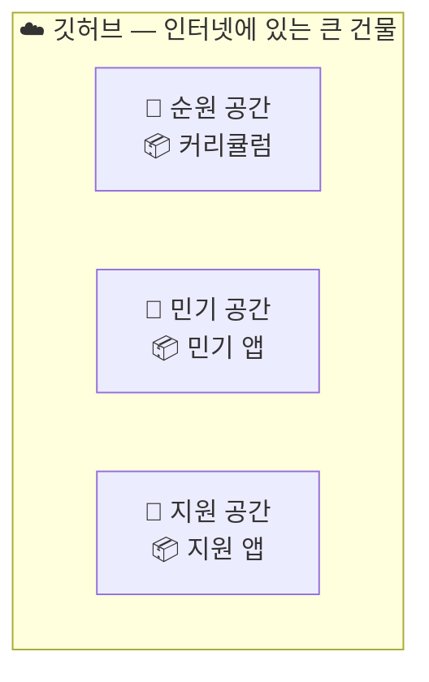
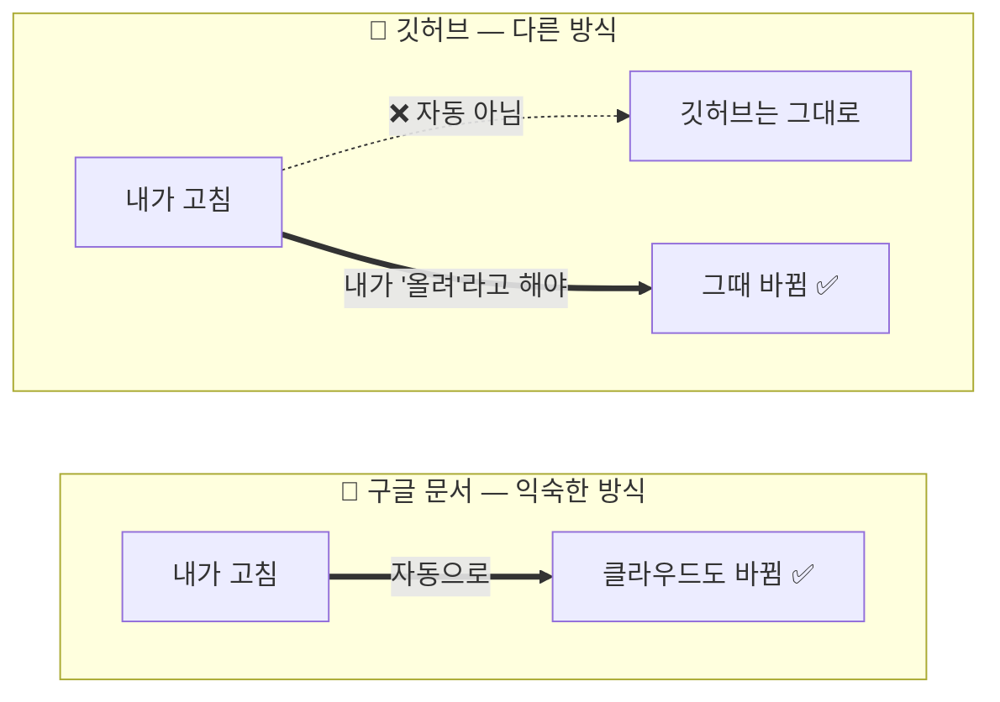
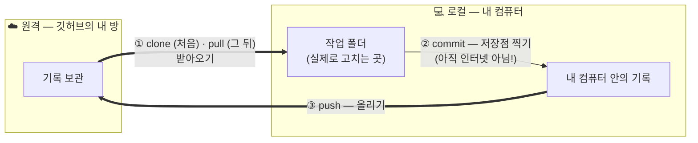
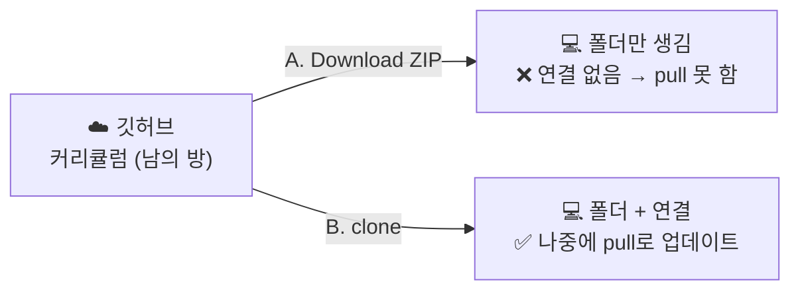
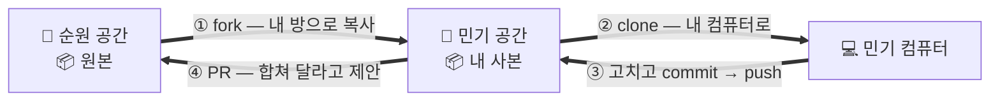
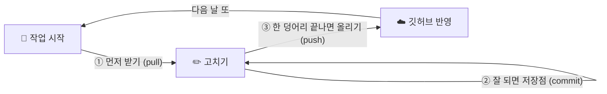

> 원문: [GitHub 계정 만들기](https://docs.github.com/en/account-and-profile/how-tos/account-management/creating-an-account-on-github) · [GitHub CLI](https://cli.github.com/) · [Git 설치](https://git-scm.com/install/)
> 수집: 2026-09-12 · 확인 범위: 계정 생성, 운영체제별 Git·GitHub CLI 설치, 로그인 명령

# GitHub로 체크포인트와 동기화 만들기

## 🎯 이 글에서 하는 일

**GitHub 계정과 내 컴퓨터를 연결**한 뒤, 같은 파일이 왜 두 곳(인터넷·내 컴퓨터)에 있는지 그림으로 이해합니다. 마지막에는 **잘 될 때 체크포인트를 찍고 어디서든 이어 일하는 리듬**까지 잡습니다.

`⭐ 쉬움 · 🕐 약 30분` · 💡 명령어를 외울 필요는 없어요. **방향만** 잡으면 됩니다. 실행은 코치가 대신 해요.

## 먼저 한 문장으로

> **GitHub는 개발자용 구글 드라이브에 타임머신을 더한 것**입니다. 파일을 클라우드에 두어 다른 컴퓨터에서도 이어 일하고, `commit`으로 잘 되던 순간을 체크포인트로 남겨 망가졌을 때 돌아갑니다.

다만 구글 드라이브처럼 자동 동기화되지는 않습니다. 체크포인트를 원격에 올리는 `push`와 다른 컴퓨터의 변경을 받는 `pull`을 직접 해야 합니다.

## 계정과 연결 도구 준비하기

1. [GitHub 가입 페이지](https://github.com/signup)에서 계정을 만듭니다. 이미 있으면 건너뜁니다.
2. 아래에서 **내 컴퓨터에 맞는 부분 하나만** 따라 합니다.
3. 연결이 끝나면 코치에게 “이 폴더에 비밀번호·API 키가 없는지 확인하고 비공개 저장소로 연결해 줘”라고 요청합니다.

### 맥북 — 터미널에서 실행

먼저 Git이 있는지 확인합니다.

```bash
git --version
```

GitHub 연결 도구를 설치하고 로그인합니다.

```bash
brew install gh
gh auth login
```

`brew: command not found`가 나오면 [GitHub CLI 공식 설치 페이지](https://cli.github.com/)의 **macOS — Download binary**를 사용하거나 코치에게 Homebrew 설치부터 부탁합니다.

### 윈도우 — PowerShell에서 실행

Git과 GitHub 연결 도구를 설치한 뒤 로그인합니다.

```powershell
winget install --id Git.Git -e --source winget
winget install --id GitHub.cli -e --source winget
gh auth login
```

설치 직후 `gh`를 찾지 못하면 PowerShell 창을 닫았다가 다시 열고 `gh auth login`을 실행합니다.

`git`은 내 컴퓨터 안에 체크포인트를 만들고, `gh`는 GitHub 계정·저장소와 연결하는 일을 쉽게 해 줍니다. 설치 화면이나 명령은 바뀔 수 있으므로 이 문서에 오래된 명령을 박아 두기보다 공식 설치 페이지를 확인합니다.

## 🔔 이 글이 필요한 신호

- "깃허브에서 받아서 쓰세요"라는데 **뭘 어떻게 받는지** 모르겠다.
- 깃허브 **웹페이지에는 파일이 보이는데 내 컴퓨터엔 없다.**
- 내 컴퓨터에서 고쳤는데 **깃허브에 가보면 그대로**다. (혹은 반대)
- `clone` · `pull` · `commit` · `push` — **네 개가 무슨 차이인지** 안 잡힌다.
- 남이 만든 깃허브 링크를 받았는데 **내가 거기에 올려도 되는 건지** 모르겠다.

---

## 그림 하나로 — 깃허브는 건물이고, 사람마다 방이 있어요

깃허브를 "파일 올리는 사이트"로만 보면 계속 헷갈려요. 이렇게 보면 한 번에 잡혀요.

> **깃허브 = 인터넷에 있는 큰 건물. 그 건물 안에 사람마다 자기 공간(계정)이 있고, 그 공간 안에 프로젝트별 상자(저장소)가 있어요.**
> 그리고 **내 컴퓨터**는 그 방에서 물건을 꺼내와 작업하는 **내 작업실**이에요.



방마다 **주인이 있어요.** 그래서 **내 방이냐 남의 방이냐에 따라 할 수 있는 게 달라요** — 이게 핵심이에요.


| | 내 방 (내 계정의 저장소) | 남의 방 (남의 계정의 저장소) |
|---|---|---|
| **받아오기** | ✅ 됨 | ✅ 됨 (공개라면 누구나) |
| **올리기** | ✅ 됨 | ❌ **안 됨** — 허락 없이는 남의 방에 못 넣어요 |

그래서 이런 일이 생겨요. **커리큘럼 레포는 "남의 방"이라, 받아서 쓰는 건 되지만 거기에 올릴 순 없어요.**
내가 만든 앱은 **내 방**에 새로 만들어 올리는 거예요. (남의 방에 뭔가 제안하고 싶으면 → 아래 [협업 섹션](#여러-사람이-같이-볼-때--남의-방에-제안하기-fork--pr))

---

## 같은 파일이 왜 두 곳에 있나

파일이 사는 곳에 각각 이름이 있어요.

| 이름 | 어디에 | 무엇 |
|---|---|---|
| **원격 (remote)** | 인터넷 — 깃허브의 내 방 | **원본이 보관된 창고.** 남과 공유하고, 컴퓨터가 망가져도 여기 남아요 |
| **로컬 (local)** | 내 컴퓨터 | **내가 받아온 사본.** 실제 작업은 **전부 여기서** 해요 |

왜 굳이 두 개냐면:

1. **인터넷이 없어도 작업**할 수 있어요 (로컬에 사본이 있으니까).
2. **내가 사본을 부숴도 원본은 멀쩡**해요.
3. **여러 컴퓨터·여러 사람**이 각자 사본을 받아 따로 일하다가 나중에 합칠 수 있어요.

### ⭐ 구글 문서와 결정적으로 다른 점 — 자동이 아니에요

여기가 헷갈림의 **90%**예요. 우리는 이미 **구글 문서·드라이브·노션**에 익숙하잖아요.
거기선 내가 고치면 클라우드도 알아서 바뀌죠. 깃허브는 **그렇지 않아요.**



> **내가 "올려"라고 해야 올라가고, "받아"라고 해야 내려옵니다.**
> 가만히 있으면 두 곳은 **영원히 따로 놉니다.**

그래서 이건 **고장이 아니라 정상**이에요:

- 내 컴퓨터에서 고쳤는데 깃허브엔 그대로 → **아직 안 올렸으니까** 당연해요.
- 깃허브에서 뭔가 바뀌었는데 내 컴퓨터는 그대로 → **아직 안 받았으니까** 당연해요.

이 문장 하나만 기억하면 이 글의 절반은 끝이에요. **git은 손으로 옮기는 것.**

---

## 오가는 방법 4개 — 이게 전부예요



| 이름 | 방향 | 언제 | 한 줄 |
|---|---|---|---|
| **clone (클론)** | 원격 → 로컬 | **딱 처음 한 번** | 창고에서 사본을 **통째로** 가져오기. "내 컴퓨터에 없던 걸 새로 만드는" 것 |
| **pull (풀)** | 원격 → 로컬 | 그 뒤로 계속 | 이미 있는 사본에 **바뀐 것만** 받아오기 |
| **commit (커밋)** | 로컬 **안에서** | 잘 될 때마다 | 저장점 찍기. **⚠️ 아직 내 컴퓨터 안 — 인터넷엔 안 갑니다** |
| **push (푸시)** | 로컬 → 원격 | 커밋한 뒤 | 내 저장점들을 창고에 **올리기** |

### 가장 많이 하는 착각: 커밋 = 업로드 아니에요

위 그림에서 **②(commit)는 로컬 상자 안에서만** 움직인다는 걸 보세요. 그게 핵심이에요.

> **고치기 → 커밋 → 푸시.** 세 단계예요.
> **커밋까지만 하면 아직 내 컴퓨터 안**이고, **푸시를 해야** 깃허브에 나타나요.

커밋은 "내 방에서 사진 찍어 서랍에 넣기", 푸시는 "그 사진을 창고로 보내기"예요.
서랍에 넣은 것만으로 창고에 도착하진 않아요.

---

## 실제로 해보기 — 이 커리큘럼 폴더를 내 컴퓨터로 가져오기

방법이 둘이에요. **초보는 A로 시작해도 괜찮아요.** 다만 차이를 알고 고르세요.



### A. ZIP 다운로드 — 제일 쉬움 (git 몰라도 됨)

1. 깃허브 저장소 페이지를 열어요.
2. 초록색 **`Code`** 버튼 클릭 → **`Download ZIP`**.
3. 받은 zip 파일을 **압축 풀기.**
4. 터미널에서 압축을 푼 폴더로 이동해 Codex CLI 또는 Claude Code를 실행해요.

- ✅ **장점:** 지금 당장, 아무 설정 없이 됩니다.
- ❌ **단점: 원격과 연결이 안 돼요.** 그래서 `pull`·`push`를 **못 해요.**
  나중에 커리큘럼이 업데이트되면 **또 다운로드해서 통째로 갈아야** 합니다.

### B. clone — 권장 (연결까지 같이 됨)

명령어를 외울 필요 없어요. **Codex CLI 또는 Claude Code를 열고 AI에게 말로 부탁하면** 코치가 대신 해줘요.

1. 깃허브 페이지에서 초록 **`Code`** 버튼 → **HTTPS** 탭 → 주소 **복사** (`https://github.com/...git` 형태).
2. AI 작업창에서 아래 프롬프트에 그 주소를 붙여 부탁해요.

- ✅ **장점:** 원격과 **연결된 상태**로 받아와요. 이후 업데이트는 "받아줘" 한 마디(=pull)면 끝.
- 처음 한 번만 하면, 그다음부터는 계속 이 폴더를 쓰면 돼요.

> 💡 **어느 쪽인지 헷갈리면 코치에게 물어보세요** — "이 폴더 깃허브랑 연결돼 있어?"
> 연결돼 있으면 pull/push가 되고, 아니면 ZIP으로 받은 거예요.

---

## 반대 방향 — 내가 만든 앱을 깃허브에 올리기 (내 방 만들기)

스텝11(배포)에서 하게 될 일이에요. 미리 그림만 잡아 둡시다.

내가 새로 만든 앱 폴더는 처음엔 **로컬만 있고 원격이 없어요.** 깃허브에 내 방이 아직 없는 상태죠.


이 뒤로는 계속 **고치기 → 커밋 → 푸시**만 반복해요.
스텝11에서 Vercel이 자동 배포해 주는 건, **Vercel이 그 방을 지켜보고 있다가 새 게 올라오면 반영**하기 때문이에요.
그래서 **푸시가 곧 배포**가 돼요.

> ⚠️ **공개(public)/비공개(private)를 만들 때 꼭 확인하세요.**
> 내 개인적인 기록이나 실험이 들어 있으면 **비공개(private)** 로 만드세요.
> 그리고 비밀값(API 키·비밀번호)이 든 `.env` 파일은 **절대 올리지 마세요** — `.gitignore`에 넣어 막습니다(코치가 챙겨 줘요).

---

## 여러 사람이 같이 볼 때 — 남의 방에 제안하기 (fork · PR)

앞에서 **남의 방엔 올릴 수 없다**고 했죠. 그럼 남의 프로젝트에 뭔가 고쳐주고 싶으면 어떻게 할까요?
**남의 방을 내 방으로 복사한 뒤, 고쳐서 "합쳐 주세요"라고 제안**해요. 이게 깃허브 협업의 전부예요.



| 단어 | 쉬운 뜻 |
|---|---|
| **fork (포크)** | 남의 방에 있는 상자를 **내 방으로 복사**해 오는 것. 이제 내 것이니 마음껏 고쳐도 됨 |
| **PR (Pull Request)** | 내가 고친 걸 **원래 주인에게 "합쳐 주실래요?"라고 보내는 제안서.** 주인이 보고 받아들이면 원본에 반영됨 |
| **collaborator (협업자)** | 주인이 나를 **자기 방 열쇠 소지자로 등록**해 준 경우. 그러면 fork 없이 바로 올릴 수 있음 |

- **혼자 만들 때는 이 섹션이 필요 없어요.** 내 방에 내가 올리면 끝이니까요.
- 같이 만드는 사람이 있으면, **주인이 협업자로 등록**해 주는 게 제일 간단해요.
- ⚠️ 여러 명이 **같은 파일을 동시에** 고치면 부딪혀요(**충돌**). 되도록 **사람마다 다른 파일·다른 화면**을 맡으세요.

---

## 일상 관리 리듬 — 매일 어떻게 하나

개념은 여기까지고, 실제로는 이 네 박자만 반복해요.



| 언제 | 뭘 | 왜 |
|---|---|---|
| **작업 시작할 때** | "새로 올라온 거 받아줘" (pull) | 여러 컴퓨터·여러 사람을 쓰면 안 받고 시작하면 부딪혀요 |
| **잘 되는 걸 확인할 때마다** | "저장점 찍어줘" (commit) | **작게 자주.** 몰아서 하면 되돌릴 지점이 없어요 |
| **기능 하나 끝날 때** | "올려줘" (push) | 여기까지 해야 **컴퓨터가 망가져도 안전**해요 |
| **큰 변경을 할 때** | "브랜치에서 작업해줘" | 잘 되던 걸 안 건드리고 실험 → [[제품01-버전관리-Git-되돌리기]] |

> 📌 **커밋만 하고 푸시를 안 하면 백업이 아니에요.** 커밋은 내 컴퓨터 안에만 있어서,
> 노트북이 고장 나면 커밋도 같이 사라져요. **하루가 끝날 때 한 번은 푸시**하는 습관을 들이세요.

---

## 🤖 코치에게 줄 프롬프트

**① 깃허브에서 내 컴퓨터로 가져오기 (clone)**
```
이 깃허브 주소를 내 컴퓨터로 가져와줘(clone): [주소 붙여넣기]
- 어디 폴더에 받을 건지 먼저 알려주고, 명령은 네가 대신 실행해줘.
- 다 되면 그 폴더를 어떻게 열면 되는지 알려줘.
```

**② 지금 상태 확인 — 제일 자주 쓸 프롬프트**
```
지금 이 폴더가 깃허브(원격)와 연결돼 있어? 연결돼 있다면,
내 컴퓨터에만 있고 아직 안 올라간 변경이 있는지, 반대로 깃허브에만 있고 내가 아직 안 받은 게 있는지
쉬운 말로 알려줘. 명령어 결과를 그대로 붙이지 말고 상황만 설명해줘.
```

**③ 올리기 (커밋 + 푸시)**
```
지금까지 바꾼 걸 저장점으로 남기고 깃허브에 올려줘.
- 커밋 메시지는 "[무엇을 했는지]"로 해줘.
- 올린 다음, 깃허브에서 내가 어디를 보면 확인되는지 알려줘.
```

**④ 받아오기 (pull)**
```
깃허브에 새로 올라온 게 있으면 내 컴퓨터로 받아줘.
내 쪽에서 고친 것과 부딪히면(충돌) 멋대로 합치지 말고, 먼저 나한테 상황을 설명해줘.
```

**⑤ 그림으로 다시 설명받기 — 헷갈릴 때마다**
```
지금 내 상황을 그림(mermaid)으로 그려줘. 깃허브(원격)에 뭐가 있고, 내 컴퓨터(로컬)에 뭐가 있고,
어느 방향으로 옮겨야 하는지 화살표로 보여줘. 글보다 그림이 이해가 빨라.
```

## ✅ 여기까지 하면 이렇게 돼요

- **깃허브 = 건물, 사람마다 방, 내 컴퓨터는 작업실**이라는 그림이 머리에 있어요.
- **내 방엔 올릴 수 있고 남의 방엔 못 올린다**를 알아요 (그래서 fork·PR이 있다는 것도).
- **"git은 자동 동기화가 아니다"**를 알아요 — 그래서 안 맞아 보여도 당황하지 않아요.
- `clone` / `pull` / `commit` / `push`를 **방향으로** 구분할 수 있어요.
- **이 커리큘럼 폴더가 내 컴퓨터에 있고**, Codex CLI 또는 Claude Code로 열려 있어요.

## ⚠️ 자주 하는 실수와 오해

- **"저장(커밋)했으니 깃허브에도 있겠지."** → 아니에요. **푸시**해야 올라가요. 가장 흔한 착각.
- **남의 방에 올리려다 거부당함.** → 정상이에요. **fork 후 PR**이거나, 주인이 **협업자로 등록**해 줘야 해요.
- **ZIP으로 받아 놓고 "받아줘(pull)"를 시킴.** → ZIP은 **연결이 없어요.** 연결이 필요하면 clone으로 다시 받으세요.
- **여러 컴퓨터(회사·집)를 쓰면서 pull을 안 함.** → **작업 시작 전에 "받아줘" 먼저.** 이 습관 하나가 사고를 크게 줄여요.
- **깃허브 웹에서 파일을 고치고, 내 컴퓨터에서도 같은 파일을 고침.** → 양쪽이 부딪혀요(**충돌**).
  겁낼 일은 아니고, **코치에게 상황 설명을 먼저 받고** 정리하면 됩니다. 되도록 **한쪽에서만** 고치세요.
- **원격에서 지웠으니 내 컴퓨터에서도 사라졌겠지.** → 아니에요. 둘은 따로예요. 받아와야 반영돼요.
- **`.env`(비밀값 파일)를 올려버림.** → **한 번 올라가면 나중에 지워도 기록에 남아요.** 올리기 전에 `.gitignore` 확인.
- **비공개로 해야 할 걸 공개로 만듦.** → 만들 때 한 번만 확인하면 되는데, 놓치기 쉬워요.

## 다음으로

마지막 공통 준비로, AI에게 실제 일을 맡길 때 필요한 재료만 골라 말하는 법을 익힙니다.
→ [[04_AI에게-일-맡기는-프롬프트-쓰는-법]]

관련: 되돌리기 안전망으로 깊게 → [[제품01-버전관리-Git-되돌리기]] ·
푸시가 곧 배포가 되는 이야기 → [[스텝11-배포-남에게-URL-보내기]] ·
내 지식 폴더를 비공개 저장소로 만들기 → [[AI01-지식베이스-깔고-AI와-연결하기]] ·
모르는 단어가 나오면 → [[용어집-비개발자용]]

> 🖼️ **이 문서의 그림은 mermaid로 그려져 있어요.** 깃허브 웹·Orca 등 Mermaid를 지원하는 미리보기에서 **그림으로 보여요.**
> 만약 코드처럼 보인다면 미리보기 모드로 바꿔 보세요. 그림이 이해에 큰 차이를 만들어서 일부러 그림으로 뒀어요.
