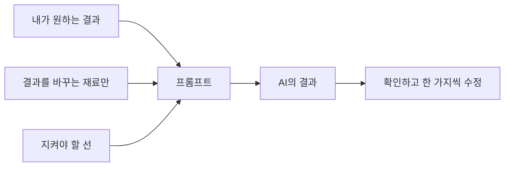

> 원문: [OpenAI Prompting](https://developers.openai.com/codex/prompting/)
> 수집: 2026-09-12 · 확인 범위: 목표·맥락·출력·경계·최종 확인과 후속 대화 원칙

# AI에게 일 맡기는 프롬프트 쓰는 법

프롬프트는 AI가 알아듣는 주문이 아닙니다. **내가 원하는 결과와 AI가 일할 때 필요한 재료를 건네는 작업 의뢰서**예요. 특별한 문법을 외우지 않아도 됩니다. 평소 말로 시작하고, 결과를 본 뒤 빠진 내용을 보태면 됩니다.

`⭐ 쉬움 · 약 15분 · AI 스텝과 프로덕트 스텝의 공통 준비`

## 생각은 내가 하고, AI는 생각을 꺼내는 일을 돕습니다

AI에게 맡기기 좋은 역할은 세 가지입니다.

| 역할 | 이렇게 부탁하세요 |
| --- | --- |
| **거친 생각을 문장으로 다듬기** | “내가 설명을 잘 못 하겠어. 내 말을 유지하면서 정리해줘.” |
| **다른 각도에서 되묻기** | “내가 놓친 점을 찾을 수 있게 질문을 하나씩 해줘.” |
| **관련 기록과 자료 찾기** | “이 폴더에서 관련 기록을 찾아 근거와 함께 알려줘.” |

AI가 후보와 의견을 줄 수는 있지만, **무엇을 할지와 왜 할지는 내가 정합니다.** 내 상황과 판단 기준을 말하지 않고 결정을 통째로 맡기면 그럴듯한 일반론이 나오기 쉽습니다.

## 긴 프롬프트보다 필요한 프롬프트

AI에게 정보를 많이 주면 무조건 좋아질 것 같지만, 필요 없는 자료까지 한꺼번에 주면 중요한 기준이 묻힙니다.



- 간단한 일은 한두 문장이면 충분합니다.
- 크거나 중요한 일만 아래 재료를 더합니다.
- **결과를 바꾸지 않는 설명과 관련 없는 문서는 빼세요.** 필요해지면 그때 추가하면 됩니다.

## 중요한 일을 맡길 때 챙길 다섯 가지

| 재료 | AI에게 알려줄 것 | 예시 |
| --- | --- | --- |
| **1. 원하는 결과** | 무엇이 끝나면 성공인지 | “지난 일주일 기록에서 자동화 후보를 찾아줘.” |
| **2. 필요한 재료** | 어떤 파일·기록·사실을 근거로 쓸지 | “`업무기록.md`와 `팀규칙.md`를 읽어줘.” |
| **3. 완성 형태** | 어디에, 어떤 모양과 길이로 만들지 | “후보·반복 횟수·절약 시간 표로 정리해줘.” |
| **4. 지킬 선** | 바꾸지 말 것, 추측하지 말 것, 먼저 물을 것 | “기록에 없는 업무는 지어내지 마.” |
| **5. 확인 방법** | 끝나기 전에 무엇으로 맞는지 검사할지 | “각 후보 옆에 근거가 된 기록을 붙여줘.” |

다섯 칸을 매번 억지로 채우지는 마세요. **빠졌을 때 결과가 달라지는 칸만** 씁니다.

## 그대로 복사해 쓰는 기본 틀

```text
[원하는 결과]
[끝내고 싶은 결과를 한 문장으로]

[필요한 재료]
- 이 파일이나 폴더를 먼저 읽어줘: [경로]
- 내 상황과 판단 기준은 이거야: [AI가 알 리 없는 내용]

[완성 형태]
- 결과를 [파일 / 표 / 체크리스트 / 초안]으로 만들어줘.
- 내가 바로 쓸 수 있게 [길이·말투·대상]을 맞춰줘.

[지킬 선]
- [건드리지 말 것]은 그대로 둬.
- 근거가 없으면 추측하지 말고 없다고 알려줘.

[끝나기 전 확인]
- 결과가 내 요청과 맞는지 확인하고, 무엇을 근거로 썼는지 알려줘.
```

## AI 스텝에서 쓰는 예시

```text
지난 일주일 업무 기록에서 반복 작업을 찾아 자동화 후보 3개를 골라줘.

- 먼저 `업무기록/`에서 지난 7일 문서와 `나의-업무기준.md`만 읽어줘.
- 후보마다 반복 횟수, 한 번에 걸리는 시간, 사람의 판단이 꼭 필요한 부분을 표로 적어줘.
- 기록에 없는 업무는 일반적인 예시로 채우지 마.
- 아직 자동화를 만들지는 말고, 내가 하나를 고를 수 있는 비교표까지만 만들어줘.
- 끝나면 어떤 기록을 근거로 골랐는지 알려줘.
```

여기서 중요한 것은 멋진 표현이 아니라 **AI가 몰랐던 내 기록과 선택 기준**입니다.

## 프로덕트 스텝에서 쓰는 예시

```text
`PRD.md`에 적힌 방명록 삭제 기능 하나를 만들어줘.

- 먼저 `PRD.md`와 현재 화면을 읽고, 바꿀 파일과 확인 방법을 짧게 말해줘.
- 각 방명록 오른쪽의 삭제 버튼을 누르면 그 글만 사라져야 해.
- 글 작성 기능과 현재 색상·배치는 건드리지 마.
- 만든 뒤 테스트를 실행하고, 내가 브라우저에서 무엇을 눌러 확인하면 되는지 알려줘.
```

제품을 만들 때 필요한 더 엄격한 순서는 프로덕트 과정의 [[스텝06-만드는-순서-요구사항-테스트-코드-검증]]에서 익힙니다.

## 첫 답이 마음에 안 들면 다시 길게 쓰지 마세요

첫 프롬프트를 완벽하게 쓰려다 멈추지 마세요. 결과에서 어긋난 부분 하나를 집어 후속 요청으로 고치면 됩니다.

```text
후보는 좋은데 너무 일반적이야.
내 기록에서 실제로 세 번 이상 반복된 것만 남기고, 각 후보에 근거 파일을 붙여줘.
표 형식은 그대로 유지해줘.
```

좋은 후속 요청에는 세 가지만 있으면 됩니다.

1. **어디가 달랐는지** — “너무 일반적이야.”
2. **어떻게 바꿀지** — “세 번 이상 반복된 것만 남겨줘.”
3. **무엇을 유지할지** — “표 형식은 그대로.”

## 결과가 이상할 때 프롬프트부터 이렇게 점검하세요

| 증상 | 먼저 의심할 것 | 다음 요청 |
| --- | --- | --- |
| 뻔한 일반론이 나옴 | 내 기록·기준이 빠짐 | “이 파일을 근거로 다시 해줘.” |
| 엉뚱한 부분까지 바뀜 | 지킬 선이 빠짐 | “이 부분만 바꾸고 나머지는 유지해줘.” |
| 답이 산만함 | 자료나 요구가 너무 많음 | “지금은 이 파일 하나와 이 결과만 다뤄줘.” |
| 다 됐다는데 못 믿겠음 | 확인 방법이 빠짐 | “어떻게 검증했는지 결과를 보여줘.” |
| 방향이 크게 다름 | 성공 모습이 모호함 | “내가 원하는 최종 모습은 이것이야.” |

## ✅ 여기까지 하면 성공

- 간단한 일에는 짧게 말하고, 중요한 일에는 필요한 재료만 골라 줄 수 있어요.
- AI가 모를 내 상황은 직접 알려주고, 이미 파일에 있는 내용은 경로를 가리킬 수 있어요.
- 원하는 결과와 지킬 선, 확인 방법을 말할 수 있어요.
- 첫 답이 어긋나도 새로 시작하지 않고 한 가지씩 방향을 고칠 수 있어요.

## 다음으로

공통 준비는 여기까지입니다.

- 코딩 없이 내 일을 줄이려면 → [[AI00-내-일에서-자동화-후보-찾기]]
- 웹앱을 만들려면 → [[스텝00-준비-프로젝트-폴더-만들기]]
- 막힐 때 바로 복사할 예문이 필요하면 → [[프롬프트-치트시트]]
