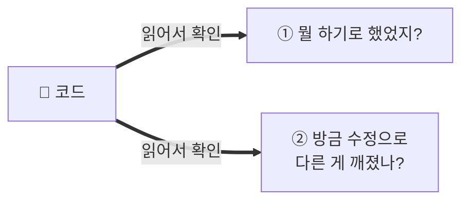
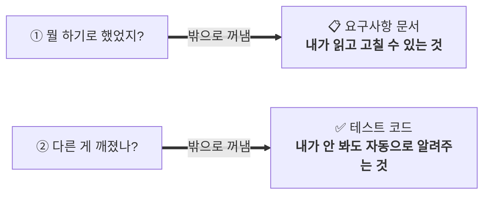
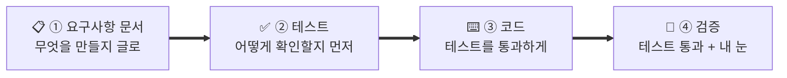
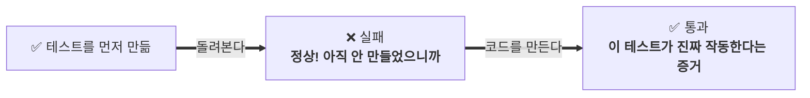
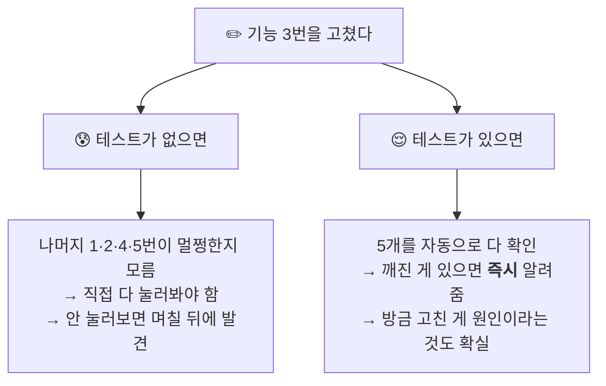
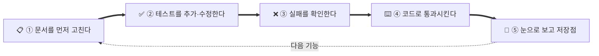

# 만드는 순서 — 요구사항 문서 → 테스트 → 코드 → 검증

## 🎯 이 글에서 하는 일

앱을 만들고 고칠 때 **어떤 순서로 진행하는지**, 그리고 **왜 그 순서여야 하는지**를 잡습니다.
이 순서를 지키면 **"하나 고쳤는데 다른 게 깨지는"** 일에서 벗어나요.

`⭐⭐ 보통 · 🕐 약 25분` · 💡 읽기만 하면 돼요. 실제 적용은 **스텝06(기능 붙이기)부터** 시작해요.

## 🔔 이 글이 필요한 신호

- **하나 고치면 멀쩡했던 다른 게 깨진다.** 그런데 뭐가 깨졌는지 한참 뒤에 발견한다.
- 앱이 커지면서 **고칠수록 더 나빠지는** 느낌이 든다.
- AI가 "다 고쳤어요"라고 하는데, **정말 그런지 확인할 방법이 없다.**
- 내가 뭘 만들라고 했는지 **나도 기억이 안 난다.** AI는 더 모른다.
- 코드를 못 읽어서 **내 앱인데 내가 통제하지 못하는** 기분이 든다.

---

## 먼저: 개발자와 나는 무엇이 다른가

개발자는 코드를 읽어서 **두 가지**를 확인해요.



**나는 둘 다 못 해요.** 코드를 못 읽으니까요. 그럼 어떻게 할까요? 답은 단순해요.

> **그 두 가지를 코드 밖으로 꺼내 두는 거예요.**



- **요구사항 문서** — 코드를 못 읽어도 **내가 직접 읽고 고칠 수 있는 원본.** 여기를 고쳐서 앱을 바꿔요.
- **테스트 코드** — 내가 코드를 안 봐도 **"원하는 것만 바뀌었다"를 대신 확인해 주는 눈.**

### ⭐ 그래서 무엇이 "원본"인가

여기가 이 글의 핵심이에요.

| | 문서·테스트가 **없으면** | 문서·테스트가 **있으면** |
|---|---|---|
| 진짜 원본은 | **코드** — 내가 읽을 수 없는 것 | **요구사항 문서 + 테스트** — 내가 읽을 수 있는 것 |
| 코드는 | 유일한 원본. 잃으면 끝 | **소모품.** AI가 다시 만들어도 됨 |
| 그래서 나는 | 내 앱의 **손님** | 내 앱의 **주인** |

> **문서와 테스트가 있으면 코드는 소모품이 돼요.** 마음에 안 들면 "다시 만들어"라고 할 수 있죠.
> 없으면 코드가 유일한 원본이고, 나는 그걸 읽을 수 없으니 **내 앱을 통제할 수 없어요.**

---

## 순서 — 그리고 각 단계가 왜 그 자리인가



### ① 요구사항 문서가 먼저인 이유

**안 정하고 만들면 AI가 상상해서 채워요.** 그리고 더 큰 문제 —
나중에 결과물을 보고 **"이게 맞나?"를 판정할 기준이 없어요.** 기준이 없으면 잘못돼도 잘못된 줄 몰라요.

- 이건 이미 [[스텝03-PRD를-대화로-뽑기]]에서 만든 **PRD가 그 문서**예요.
- 중요한 건 **PRD를 한 번 쓰고 끝내지 않는 것.** 기능을 바꿀 때마다 **문서를 먼저 고쳐요.**
  코드를 못 읽는 나에게 **문서가 유일하게 손댈 수 있는 원본**이니까요.

### ② 테스트가 코드보다 먼저인 이유 (가장 안 익숙한 부분)

"만들지도 않은 걸 어떻게 확인해?"라고 생각되죠. 그런데 순서를 바꾸면 **테스트가 쓸모없어져요.**

| | 테스트를 **나중에** 쓰면 | 테스트를 **먼저** 쓰면 |
|---|---|---|
| 무엇에 맞춰 쓰나 | **이미 만들어진 코드**에 맞춰서 | **요구사항**에 맞춰서 |
| 그래서 확인하는 건 | "코드가 하는 일" | **"내가 원한 일"** |
| 코드가 틀렸을 때 | 틀린 대로 통과 ✅ (못 잡음) | **실패로 잡힘** ❌ |

나중에 쓰는 테스트는 **틀린 걸 틀렸다고 말해주지 못해요.** 코드를 보고 썼으니 코드에 동의할 뿐이죠.

그리고 실용적으로 더 중요한 이유가 하나 더 있어요.



> **처음엔 테스트가 실패해야 정상이에요.**
> 실패하는 걸 봤다가 통과하는 걸 봐야, **그 테스트가 진짜로 뭔가를 검사한다는 걸** 알 수 있어요.
> 이걸 안 보면, **아무것도 검사하지 않는 껍데기 테스트**를 AI가 만들어 놔도 나는 알 수가 없어요.
> (AI가 늘 성실한 건 아니라서, 통과만 시키는 빈 테스트를 만들기도 해요. 이 확인이 그걸 막아요.)

### ③ 코드는 "테스트를 통과하는 만큼만"

AI에게 맡기는 부분이에요. 다만 **테스트를 통과시키는 데 필요한 만큼만** 만들라고 해요.
안 그러면 부탁하지 않은 기능까지 붙여서, 나중에 뭐가 뭔지 알 수 없게 돼요.

### ④ 검증은 두 겹이에요

- **테스트 전부 통과** — 기계가 확인. "**안 깨졌다**"를 말해줘요.
- **내 눈으로 화면 확인** — 사람이 확인. "**쓸만하다**"는 테스트가 못 말해요.

테스트가 다 통과해도 **버튼이 이상한 곳에 있거나 흐름이 어색한 건 잡히지 않아요.** 그건 내 몫이에요.

---

## 테스트가 실제로 뭘 해주나 (회귀 막기)

이게 **비개발자에게 테스트가 필요한 가장 큰 이유**예요.

기능이 5개인 앱에서 기능 하나를 고쳤다고 해봅시다.



이렇게 **고친 곳이 아닌 다른 데가 깨지는 것**을 **회귀(regression)**라고 해요.
AI 코딩에서 특히 잘 일어나요 — AI는 대화가 길어지면 앞서 정한 걸 잊고 엉뚱한 데를 건드리니까요.

> **앱이 60~70%쯤 완성됐을 때 "고칠수록 더 나빠지는" 그 현상의 정체가 회귀예요.**
> 기능이 늘어날수록 손으로 다 확인하는 게 불가능해지는데, 확인을 안 하니까 깨진 채로 쌓여요.
> → 관련: [[자주-막히는것-FAQ]]

---

## 기능 하나 고칠 때 도는 루프

한 번 익히면 계속 이 다섯 박자예요.



| 박자 | 코치에게 할 말 |
|---|---|
| ① 문서 | "PRD에 이 기능을 이렇게 바꿔서 적어줘. 아직 코드는 짜지 마." |
| ② 테스트 | "그 요구사항대로 테스트부터 만들어줘. 코드는 아직." |
| ③ 실패 확인 | "테스트 돌려봐. 지금은 실패해야 정상이야. 결과 보여줘." |
| ④ 코드 | "이제 그 테스트가 통과하게 만들어줘. 필요한 것만." |
| ⑤ 검증 | "테스트 전부 돌려서 다 통과하는지 보여주고, 저장점 찍어줘." |

> ⚠️ **첫 화면(스텝05)까지는 이 루프를 안 써도 돼요.** 기능이 하나뿐이면 깨질 다른 게 없으니까요.
> **기능이 2개 이상 쌓이는 [[스텝06-기능-붙이기-티키타카-루프]]부터** 적용하세요.
> 처음부터 이걸 하면 **첫 승리가 늦어져서** 재미를 잃어요. 순서에도 순서가 있어요.

---

## 🤖 코치에게 줄 프롬프트

**① 이 방식으로 진행하라고 못 박기 (규칙 파일에 넣기)**
```
앞으로 기능을 추가·수정할 때 이 순서를 지켜줘:
1) PRD(요구사항 문서)를 먼저 고치고 나에게 보여준다
2) 그 요구사항대로 테스트를 먼저 만든다
3) 테스트를 돌려서 "실패하는 것"을 나에게 보여준다 (이게 정상)
4) 그 테스트가 통과하게 코드를 만든다 — 필요한 것만
5) 전체 테스트를 돌려 다 통과하는지 보여주고, 저장점을 찍는다
이 순서를 AGENTS.md(또는 CLAUDE.md)에 규칙으로 적어줘.
```

**② 테스트가 껍데기인지 확인하기**
```
방금 만든 테스트가 정말로 뭔가를 검사하는지 확인하고 싶어.
코드를 일부러 살짝 망가뜨렸을 때 그 테스트가 실패하는지 보여줘. (그다음 원상복구해줘)
실패하지 않으면 그 테스트는 껍데기니까 다시 만들어줘.
```

**③ 회귀 점검**
```
방금 수정으로 다른 기능이 깨지지 않았는지 전체 테스트를 돌려서 알려줘.
깨진 게 있으면 어느 기능이 왜 깨졌는지 쉬운 말로 설명해줘. 고치는 건 내가 좋다고 한 다음에.
```

**④ 그림으로 설명받기**
```
지금 우리가 이 순서 중 어디에 있는지 그림(mermaid)으로 그려줘.
그리고 다음에 뭘 해야 하는지 한 줄로 알려줘.
```

## ✅ 여기까지 하면 이렇게 돼요

- **왜 문서와 테스트가 코드보다 중요한지** 내 말로 설명할 수 있어요 (내가 읽을 수 있는 원본이니까).
- **테스트를 먼저 쓰는 이유**를 알아요 (나중에 쓰면 코드에 동의만 하게 되니까).
- **처음엔 테스트가 실패해야 정상**이라는 걸 알아요 (껍데기 테스트를 걸러내는 장치).
- **회귀**라는 이름을 알고, 왜 앱이 커질수록 무서워지는지 알아요.
- 기능 하나 고칠 때 **다섯 박자 루프**를 돌릴 수 있어요.

## ⚠️ 자주 하는 실수

- **문서를 안 고치고 코드만 고침.** 그러면 문서와 앱이 어긋나고, 시간이 지나면 **문서가 거짓말**이 돼요. 그때부턴 내가 읽을 수 있는 원본이 사라져요.
- **테스트를 코드 다음에 씀.** 코드에 맞춰 쓰게 되어 **틀린 걸 못 잡아요.**
- **실패를 안 보고 넘어감.** 껍데기 테스트를 걸러낼 유일한 기회를 버리는 거예요.
- **테스트가 통과했으니 다 됐다고 믿기.** 테스트는 "안 깨졌다"만 말해요. **쓸만한지는 내가 봐야** 해요.
- **처음부터 테스트를 100% 갖추려고 함.** 지치고 첫 승리가 늦어져요. **중요한 기능부터 하나씩.**
- **AI에게 "테스트도 알아서 해줘"만 하고 결과를 안 봄.** 그러면 껍데기가 쌓여요. **실패→통과를 눈으로.**

## 다음으로

- 요구사항 문서(PRD)를 처음 뽑는 법 → [[스텝03-PRD를-대화로-뽑기]]
- 이 루프를 실제로 적용하는 곳 → [[스텝06-기능-붙이기-티키타카-루프]]
- 깨졌을 때 되돌리기 → [[제품01-버전관리-Git-되돌리기]]
- 테스트·모니터링·백업을 더 깊게 → [[제품04-안-무너지게-테스트-모니터링-백업]]
- 이 순서를 규칙 파일로 못 박기 → [[AI02-AI가-안-헤매게-규칙과-계획-고정하기]]
- 관련 참고: [[용어집-비개발자용]] · [[자주-막히는것-FAQ]]

> 🖼️ 이 문서의 그림은 mermaid예요. 깃허브 웹·Cursor 미리보기·옵시디언에서 **그림으로 보여요.**
