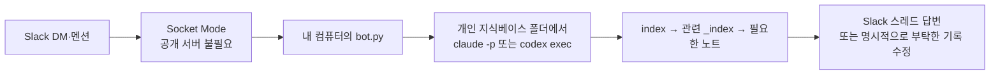

> 원문: [Slack Socket Mode](https://docs.slack.dev/apis/events-api/using-socket-mode/) · [Slack 앱 매니페스트](https://docs.slack.dev/app-manifests/) · [Slack Bolt for Python](https://docs.slack.dev/tools/bolt-python/getting-started/) · [Slack 무료 플랜 제한](https://slack.com/help/articles/27204752526611-Feature-limitations-on-the-free-version-of-Slack) · [Codex Cloud](https://developers.openai.com/codex/cloud/) · [Codex Remote](https://learn.chatgpt.com/codex/remote) · [Claude Code Remote Control](https://code.claude.com/docs/en/remote-control) · [Claude Code on the web](https://code.claude.com/docs/en/claude-code-on-the-web) · [Claude Code CLI](https://code.claude.com/docs/en/cli-usage)
> 수집: 2026-09-14 · 확인 범위: Socket Mode, 앱 권한, 무료 메시지 보관, 모바일의 클라우드·로컬 실행 차이, AI CLI 비대화형 실행 옵션

# 개인 지식베이스를 바라보는 슬랙봇 빌드 키트

이 문서는 평소에 읽는 지식 노트가 아니라 **슬랙봇을 만들 때만 AI가 꺼내 읽는 선택형 설치 설명서**입니다. 개인 지식베이스 템플릿에 함께 들어 있지만 `AGENTS.md`나 `CLAUDE.md`에 합치지 않습니다. 긴 설치 문서를 매 대화마다 읽히면 컨텍스트만 차지하기 때문입니다.

## 결론

**노트북을 켜지 않고 모바일에서 시작하는 것이 목적이면 이 봇부터 만들지 않습니다.** 비공개 GitHub 저장소가 최신이라면 Codex Cloud나 Claude Code on the web을 모바일에서 쓰는 쪽이 설치가 적습니다.

이 키트는 Slack 스레드를 개인 비서의 고정 입구로 쓰고 싶거나, 클라우드에 아직 올리지 않은 로컬 파일·내 컴퓨터의 도구가 필요할 때만 선택합니다. 개인용 첫 버전은 이것만 합니다.

> 내 Slack DM·멘션 → 내 컴퓨터의 봇 → 개인 지식베이스 폴더에서 AI CLI를 한 번 실행 → 관련 기록을 찾아 답하거나, 명시적으로 부탁한 노트를 고침

회사 개발자용 원본에 있던 여러 팀 레포, Datadog·QueryPie·사내 위키, 자율 PR, 격리 worktree는 모두 뺍니다. 개인용 봇은 **지식베이스 한 곳에서 질문하고 기록하는 기능**으로 시작합니다.

## 먼저 모바일 실행 방식을 고릅니다

| 방식 | 노트북을 미리 켜고 세션을 열어야 하나? | 지식베이스는 어디 것을 보나? |
| --- | --- | --- |
| **Codex Cloud** | 아니오. 클라우드 작업은 로컬 컴퓨터를 점유하지 않고 백그라운드에서 실행됨 | 연결한 GitHub·GitLab 저장소의 브랜치·커밋 |
| **Codex Remote** | 로컬 세션을 미리 열 필요는 없지만, 연결한 PC를 깨어 있고 온라인인 상태로 둬야 함 | 연결한 PC의 로컬 프로젝트 |
| **Claude Code on the web** | 아니오. 클라우드 세션은 브라우저를 닫아도 계속됨 | 연결한 GitHub 저장소 |
| **Claude Code Remote Control** | **예.** `claude remote-control`이나 `claude --remote-control` 세션과 노트북이 실행 중이어야 함 | 노트북의 로컬 파일·MCP·도구 |
| **이 Slack 봇** | AI 대화 세션은 미리 열 필요 없음. 대신 `bot.py`와 노트북이 실행 중이어야 함 | 노트북의 로컬 지식베이스 |

즉, **GitHub에 최신 지식베이스가 있고 휴대폰에서 클라우드 실행을 시작할 수 있으면 공식 Codex·Claude 화면이 기본 선택**입니다. `Remote`와 `Remote Control`은 휴대폰에서 보이더라도 실제 작업은 내 컴퓨터에서 돌아가므로 컴퓨터가 필요합니다. 클라우드가 고친 내용은 원격 저장소에 반영한 뒤 노트북에서 `pull`해야 로컬에도 생깁니다. 로컬에만 있는 최신 변경, 로컬 MCP·프로그램, Slack 스레드 UI, 나중에 붙일 개인 자동화가 필요하면 이 봇을 고릅니다. 앱 기능과 이름은 바뀔 수 있으니 설치하는 날 AI에게 공식 문서의 현재 지원 범위를 다시 확인시킵니다.

## 그래도 Slack을 고르는 이유

- **스레드가 주제별 대화 묶음**이 되어, 질문이 섞이지 않습니다.
- PC와 모바일에서 긴 답변·코드블록·링크를 보기 편합니다.
- 멘션과 DM을 나눠 쓸 수 있고, 나중에 다른 사람 한 명을 초대하기도 쉽습니다.
- “기록해줘”, “이번 주 회고 만들어줘”처럼 내 Skill과 자동화의 고정 입구로 확장하기 쉽습니다.

Telegram도 가능하지만, 이 키트는 실제 사용에서 스레드와 긴 답변 UI가 편했던 Slack을 기본값으로 둡니다.

단점도 있습니다. Slack 무료 플랜은 최근 90일만 검색·열람할 수 있고, 현재 정책상 1년보다 오래된 메시지와 파일은 삭제될 수 있습니다. 그래서 **Slack은 대화 화면이지 지식의 원본이 아닙니다.** 오래 남길 결정·경험은 지식베이스 Markdown 파일이 소유합니다.

대화 원문까지 로컬에 남기고 싶을 때만 `SAVE_CONVERSATIONS=true`를 켭니다. 기본값은 `false`입니다. 원문 로그를 켜더라도 그것은 임시 기록일 뿐, 중요한 결론은 나중에 맞는 지식 노트로 정리합니다.

## 동작 구조



AI 모델이 Slack 안에 들어가는 것이 아닙니다. Slack은 요청을 전달하는 화면이고, 실제 작업은 **내 컴퓨터에서 봇이 요청마다 새 AI CLI를 실행해** 처리합니다. 그래서 Claude·Codex 세션을 매번 미리 열 필요는 없지만, 컴퓨터와 `bot.py`는 켜져 있어야 합니다. 컴퓨터가 꺼지거나 잠들면 봇도 답하지 못합니다.

각 질문은 새 AI 실행으로 시작합니다. 대신 같은 Slack 스레드의 앞 대화를 질문과 함께 넘기므로, **스레드 안에서는 문맥이 이어지고 스레드끼리는 섞이지 않습니다.**

## 이 문서를 AI에게 주는 말

개인 지식베이스 폴더에서 Codex CLI나 Claude Code를 열고 아래 문장만 입력합니다.

```text
개인지식베이스를-바라보는-슬랙봇-빌드키트.md를 끝까지 읽고,
먼저 Codex·Claude의 모바일 클라우드만으로 내 요구가 해결되는지 공식 문서로 확인해줘.
휴대폰에서 쓸 수 있는 공식 클라우드 실행으로 충분하면 이 봇은 만들지 말고, 내 비공개 GitHub 저장소를 연결해
휴대폰에서 질문하고 기록을 수정하는 가장 짧은 흐름을 실제로 검증해줘.

Slack 스레드나 로컬 파일·도구가 꼭 필요하면,
내 개인 지식베이스를 읽고 명시적으로 부탁한 기록은 수정하는 Slack 개인 AI 비서를 실제로 만들어줘.

- 먼저 내가 쓰는 운영체제와 AI CLI, 지식베이스 절대경로를 확인해.
- 개인 Slack 워크스페이스가 없으면 만드는 화면부터 브라우저로 안내하고 가능한 클릭은 네가 해.
- Slack 앱은 이 문서의 매니페스트로 만들고 최소 권한만 줘.
- 로그인·2단계 인증·앱 설치 승인처럼 내가 해야 하는 순간에만 한 가지씩 요청해.
- 토큰은 채팅에 출력하지 말고 봇 폴더의 .env에만 저장하고 .gitignore를 확인해.
- 코드는 이 문서의 파일을 베이스로 만들되 내 절대경로와 AI CLI에 맞게 바꿔.
- 먼저 터미널에서 실행하고, 내가 Slack에서 DM → 후속 질문을 스레드로 보내는 것까지 실제로 검증해.
- 단순 질문에는 파일을 바꾸지 말고, 내가 기록·수정을 명시적으로 부탁했을 때만 지식베이스 안에서 고쳐.
- 삭제·대량 변경·외부 발송·공개·결제는 실행 직전에 Slack 스레드에서 확인받아.
- 검증이 끝난 뒤에만 내 운영체제의 로그인 시 자동 시작을 선택지로 물어봐.
```

AI는 설명만 하고 끝내지 않습니다. 브라우저 도구와 터미널을 쓸 수 있다면 앱 생성·파일 작성·설치·실행·검증까지 직접 합니다. 다만 Slack 로그인, 2단계 인증, 권한 승인은 사용자가 합니다.

## AI가 사용자에게 확인할 세 가지

| 확인할 것 | 예시 |
| --- | --- |
| 개인 지식베이스 절대경로 | `/Users/me/Documents/my-knowledge-base` |
| 사용할 AI CLI | `claude` 권장, 이미 Codex만 쓰면 `codex` |
| Slack 개인 워크스페이스 | 기존 개인 공간 또는 새 무료 워크스페이스 |

봇 표시 이름은 기본 `my-knowledge-bot`으로 두고, 사용자가 원할 때만 바꿉니다.

## 1. Slack 앱 만들기 — AI가 브라우저로 진행

AI는 [Slack 앱 관리 화면](https://api.slack.com/apps)을 열어 **Create New App → From an app manifest**를 고르고, 사용자의 개인 워크스페이스를 선택한 뒤 아래 JSON을 넣습니다.

사용자가 직접 해야 하는 것은 로그인·2단계 인증·`Allow` 승인뿐입니다.

<details>
<summary>Slack 앱 매니페스트 — 그대로 사용</summary>

```json
{
  "display_information": {
    "name": "my-knowledge-bot",
    "description": "내 로컬 지식베이스를 근거로 답하고 기록하는 개인 AI 비서"
  },
  "features": {
    "app_home": {
      "home_tab_enabled": false,
      "messages_tab_enabled": true,
      "messages_tab_read_only_enabled": false
    },
    "bot_user": {
      "display_name": "my-knowledge-bot",
      "always_online": true
    }
  },
  "oauth_config": {
    "scopes": {
      "bot": [
        "app_mentions:read",
        "chat:write",
        "channels:history",
        "groups:history",
        "im:history",
        "im:read"
      ]
    }
  },
  "settings": {
    "event_subscriptions": {
      "bot_events": [
        "app_mention",
        "message.im"
      ]
    },
    "socket_mode_enabled": true,
    "org_deploy_enabled": false,
    "token_rotation_enabled": false
  }
}
```

</details>

앱을 만든 뒤 AI가 다음을 진행합니다.

1. **Install to Workspace**에서 앱을 설치하고 Bot User OAuth Token(`xoxb-`)을 받습니다.
2. **Basic Information → App-Level Tokens**에서 `connections:write` 하나만 가진 토큰(`xapp-`)을 만듭니다.
3. 사용자의 Slack 프로필에서 **Copy member ID**로 본인 ID(`U...`)를 확인합니다.
4. 세 값을 화면이나 채팅에 다시 출력하지 않고 봇 폴더의 `.env`에 바로 저장합니다.

토큰을 얻기 전에 봇 폴더와 `.gitignore`를 먼저 만들어 둡니다. 화면 자동화가 토큰을 안전하게 파일로 옮길 수 없으면 AI가 값을 요구하지 말고, 사용자가 `.env`의 빈칸에 직접 붙이도록 안내합니다.

## 2. AI가 만들 파일

봇 코드는 지식 노트와 섞지 않습니다. AI가 지식베이스 **옆에** `<지식베이스이름>-slack-bot/` 폴더를 만들고 아래 파일을 생성합니다.

```text
my-knowledge-base/
└── ... 개인 지식 노트

my-knowledge-base-slack-bot/
├── bot.py
├── bot-system-prompt.md
├── .env.example
├── .env                 ← 토큰·절대경로, Git 금지
├── .gitignore
└── conversations/       ← 선택형 로컬 로그, Git 금지
```

### `bot.py` — Slack과 AI CLI 연결

<details>
<summary>전체 코드</summary>

```python
import json
import logging
import os
import re
import shutil
import subprocess
import threading
import time
from pathlib import Path

from dotenv import load_dotenv
from slack_bolt import App
from slack_bolt.adapter.socket_mode import SocketModeHandler


BASE_DIR = Path(__file__).resolve().parent
load_dotenv(BASE_DIR / ".env")

logging.basicConfig(
    level=logging.INFO,
    format="%(asctime)s %(levelname)s %(message)s",
)
log = logging.getLogger("personal-kb-slack-bot")

KB_PATH = Path(os.environ["KB_PATH"]).expanduser().resolve()
AI_CLI = os.environ.get("AI_CLI", "claude").strip().lower()
ALLOWED_USERS = {
    value.strip()
    for value in os.environ.get("ALLOWED_SLACK_USER_IDS", "").split(",")
    if value.strip()
}
SAVE_CONVERSATIONS = (
    os.environ.get("SAVE_CONVERSATIONS", "false").strip().lower() == "true"
)
TIMEOUT_SECONDS = int(os.environ.get("AI_TIMEOUT_SECONDS", "900"))
MAX_THREAD_MESSAGES = 20
SLACK_CHUNK = 3500

if not KB_PATH.is_dir():
    raise RuntimeError(f"KB_PATH 폴더가 없습니다: {KB_PATH}")
if not (KB_PATH / "index.md").is_file():
    raise RuntimeError(f"지식베이스 루트에 index.md가 없습니다: {KB_PATH}")
if AI_CLI not in {"claude", "codex"}:
    raise RuntimeError("AI_CLI는 claude 또는 codex여야 합니다.")
if not ALLOWED_USERS:
    raise RuntimeError("ALLOWED_SLACK_USER_IDS에 본인 Slack member ID를 넣어야 합니다.")

SYSTEM_PROMPT = (BASE_DIR / "bot-system-prompt.md").read_text(encoding="utf-8")

app = App(token=os.environ["SLACK_BOT_TOKEN"])
BOT_USER_ID = app.client.auth_test()["user_id"]


def strip_mention(text: str) -> str:
    return re.sub(r"<@[A-Z0-9]+>", "", text or "").strip()


def fetch_thread(client, channel: str, thread_ts: str, current_ts: str) -> list[str]:
    try:
        result = client.conversations_replies(
            channel=channel,
            ts=thread_ts,
            limit=MAX_THREAD_MESSAGES,
        )
    except Exception as error:
        log.warning("스레드 조회 실패: %s", error)
        return []

    messages = []
    for message in result.get("messages", []):
        if message.get("ts") == current_ts:
            continue
        text = strip_mention(message.get("text", ""))
        if not text:
            continue
        who = "봇" if message.get("bot_id") or message.get("user") == BOT_USER_ID else "사용자"
        messages.append(f"{who}: {text}")
    return messages


def build_prompt(question: str, thread_messages: list[str]) -> str:
    history = "\n".join(thread_messages[-MAX_THREAD_MESSAGES:])
    return f"""\
{SYSTEM_PROMPT}

=== 현재 Slack 스레드의 앞 대화 ===
{history or "(앞 대화 없음)"}

=== 현재 질문 ===
{question}
"""


def clean_agent_environment() -> dict[str, str]:
    env = os.environ.copy()
    # AI가 Slack 토큰을 읽거나 답변에 노출할 이유가 없으므로 하위 프로세스에서 제거합니다.
    env.pop("SLACK_BOT_TOKEN", None)
    env.pop("SLACK_APP_TOKEN", None)
    return env


def run_ai(prompt: str) -> str:
    if AI_CLI == "claude":
        command = [
            "claude",
            "-p",
            "--output-format",
            "text",
            "--permission-mode",
            "acceptEdits",
            "--tools",
            "Read,Grep,Glob,Edit,Write",
            "--no-session-persistence",
        ]
    else:
        command = [
            "codex",
            "exec",
            "--sandbox",
            "workspace-write",
            "--approve-for-me",
            "--ephemeral",
            "--cd",
            str(KB_PATH),
            "-",
        ]

    if shutil.which(command[0]) is None:
        raise RuntimeError(f"{command[0]} CLI를 찾을 수 없습니다.")

    result = subprocess.run(
        command,
        input=prompt,
        cwd=KB_PATH,
        env=clean_agent_environment(),
        capture_output=True,
        text=True,
        encoding="utf-8",
        errors="replace",
        timeout=TIMEOUT_SECONDS,
        check=False,
    )
    if result.returncode != 0:
        error = (result.stderr or result.stdout).strip()
        raise RuntimeError(error[-800:] or f"AI CLI 종료 코드 {result.returncode}")
    return result.stdout.strip() or "(빈 응답)"


def save_conversation(record: dict) -> None:
    if not SAVE_CONVERSATIONS:
        return
    try:
        directory = BASE_DIR / "conversations"
        directory.mkdir(exist_ok=True)
        path = directory / time.strftime("%Y-%m.jsonl")
        with path.open("a", encoding="utf-8") as file:
            file.write(
                json.dumps(
                    {"created_at": time.strftime("%Y-%m-%dT%H:%M:%S"), **record},
                    ensure_ascii=False,
                )
                + "\n"
            )
    except Exception as error:
        log.warning("대화 로그 저장 실패: %s", error)


def update_with_chunks(client, channel: str, message_ts: str, thread_ts: str, text: str) -> None:
    chunks = [
        text[index : index + SLACK_CHUNK]
        for index in range(0, len(text), SLACK_CHUNK)
    ] or ["(빈 응답)"]
    client.chat_update(channel=channel, ts=message_ts, text=chunks[0])
    for chunk in chunks[1:]:
        client.chat_postMessage(channel=channel, thread_ts=thread_ts, text=chunk)


def answer_in_background(client, event: dict) -> None:
    user_id = event.get("user", "")
    if user_id not in ALLOWED_USERS:
        log.warning("허용되지 않은 사용자 요청 차단: %s", user_id)
        return

    channel = event["channel"]
    message_ts = event["ts"]
    thread_ts = event.get("thread_ts") or message_ts
    question = strip_mention(event.get("text", ""))

    if question.lower() in {"status", "ping", "상태", "핑"}:
        client.chat_postMessage(
            channel=channel,
            thread_ts=thread_ts,
            text=f"✅ 봇 실행 중 · AI={AI_CLI} · 지식베이스={KB_PATH.name}",
        )
        return

    if not question:
        client.chat_postMessage(
            channel=channel,
            thread_ts=thread_ts,
            text="질문을 함께 적어주세요.",
        )
        return

    thread_messages = fetch_thread(client, channel, thread_ts, message_ts)
    progress = client.chat_postMessage(
        channel=channel,
        thread_ts=thread_ts,
        text="🔍 개인 지식베이스에서 관련 기록을 찾는 중…",
    )
    started = time.monotonic()
    answer = ""
    ok = False

    try:
        prompt = build_prompt(question, thread_messages)
        answer = run_ai(prompt)
        ok = True
        update_with_chunks(
            client,
            channel,
            progress["ts"],
            thread_ts,
            answer,
        )
    except subprocess.TimeoutExpired:
        answer = "⏱️ 답변 시간이 너무 길어 중단했어요. 질문 범위를 조금 줄여주세요."
        client.chat_update(channel=channel, ts=progress["ts"], text=answer)
    except Exception as error:
        log.exception("답변 실패")
        answer = f"❌ 답변하지 못했어요. 봇 로그를 확인해 주세요. ({type(error).__name__})"
        client.chat_update(channel=channel, ts=progress["ts"], text=answer)
    finally:
        save_conversation(
            {
                "user": user_id,
                "channel": channel,
                "thread_ts": thread_ts,
                "question": question,
                "answer": answer,
                "ok": ok,
                "duration_seconds": round(time.monotonic() - started, 1),
            }
        )


def dispatch(client, event: dict) -> None:
    threading.Thread(
        target=answer_in_background,
        args=(client, event),
        daemon=True,
    ).start()


@app.event("app_mention")
def on_mention(event, client):
    dispatch(client, event)


@app.event("message")
def on_message(event, client):
    if event.get("channel_type") != "im":
        return
    if event.get("bot_id") or event.get("user") == BOT_USER_ID or event.get("subtype"):
        return
    dispatch(client, event)


if __name__ == "__main__":
    log.info("봇 시작 · AI=%s · KB=%s", AI_CLI, KB_PATH)
    SocketModeHandler(app, os.environ["SLACK_APP_TOKEN"]).start()
```

</details>

### `bot-system-prompt.md` — 개인 AI 비서 규칙

```markdown
너는 이 개인 지식베이스를 근거로 답하고 기록하는 Slack 개인 AI 비서다.

1. 먼저 루트 index.md에서 방향을 잡고, 질문과 관련된 폴더의 _index.md를 거쳐 필요한 노트만 읽어라.
2. 폴더 전체를 훑거나 모든 문서를 읽지 마라.
3. 일반론보다 이 지식베이스에 기록된 사용자의 경험·결정·선호를 우선하라.
4. 질문이나 설명 요청에는 답만 하고 파일을 바꾸지 마라. 사용자가 "기록해줘", "추가해줘", "고쳐줘"처럼 변경을 명시했을 때만 파일을 수정하라.
5. 기록할 때는 같은 주제의 기존 노트에 병합하고 낡은 결론은 교체하라. 새 주제일 때만 새 파일을 만들고 관련 인덱스를 함께 갱신하라. 저장소 규칙이 체크포인트를 요구하고 명령 도구가 있으면 커밋·푸시까지 하고, 명령 도구가 없으면 로컬 변경과 체크포인트가 남았다고 분명히 알려라.
6. 삭제·대량 변경·외부 발송·공개·결제·권한 확대처럼 되돌리기 어렵거나 컴퓨터 밖에 영향을 주는 일은 먼저 할 일과 영향을 설명하고, 같은 Slack 스레드에서 명시적인 확인을 받은 다음 실행하라.
7. 기록이 없거나 서로 충돌하면 추측으로 메우지 말고 무엇이 없어 모호한지 물어라.
8. 비밀번호·토큰·개인정보처럼 질문에 불필요한 민감정보는 읽거나 답변에 노출하지 마라.
9. 답변 첫머리에 결론을 쓰고, 마지막에 근거로 사용하거나 바꾼 노트 파일명을 짧게 밝혀라.
10. Slack에서 읽기 쉽게 한국어로 간결하게 답하라. 긴 원문을 그대로 복사하지 마라.
```

### `.env.example` — 사용자마다 바꿀 값

```dotenv
# 개인 지식베이스의 절대경로
KB_PATH=/Users/me/Documents/my-knowledge-base

# claude 또는 codex
AI_CLI=claude

# Slack 앱에서 발급한 비밀값
SLACK_BOT_TOKEN=xoxb-여기에-입력
SLACK_APP_TOKEN=xapp-여기에-입력

# Slack 프로필의 Copy member ID로 얻은 본인 ID. 쉼표로 여러 명을 허용할 수 있으나 개인용은 한 명만 권장.
ALLOWED_SLACK_USER_IDS=U0123456789

# Slack의 오래된 메시지가 사라져도 원문을 로컬 JSONL로 남기고 싶을 때만 true
SAVE_CONVERSATIONS=false
AI_TIMEOUT_SECONDS=900

# 백그라운드 실행에서 Claude 로그인이 풀릴 때만 claude setup-token 결과를 넣습니다.
# 평소 터미널 실행에서 claude -p가 되면 비워 둡니다.
CLAUDE_CODE_OAUTH_TOKEN=
```

### `.gitignore` — 비밀값과 대화 원문 제외

```gitignore
.env
.venv/
__pycache__/
bot.log
conversations/
```

## 3. 맥북에서 실행 — 명령은 AI가 대신

```bash
cd "/절대경로/my-knowledge-base-slack-bot"
python3 -m venv .venv
.venv/bin/python -m pip install --upgrade pip
.venv/bin/python -m pip install slack-bolt python-dotenv
cp .env.example .env
```

AI가 `.env`를 채운 뒤 먼저 CLI 자체를 확인합니다.

```bash
cd "/절대경로/my-knowledge-base"
claude -p "index.md를 읽고 이 지식베이스의 주제를 한 문장으로 알려줘"
```

Codex를 골랐다면:

```bash
codex exec --sandbox workspace-write --approve-for-me --ephemeral --cd "/절대경로/my-knowledge-base" \
  "index.md를 읽고 이 지식베이스의 주제를 한 문장으로 알려줘"
```

그다음 봇을 실행합니다.

```bash
cd "/절대경로/my-knowledge-base-slack-bot"
.venv/bin/python bot.py
```

## 4. 윈도우에서 실행 — PowerShell 명령은 AI가 대신

```powershell
Set-Location "C:\절대경로\my-knowledge-base-slack-bot"
py -m venv .venv
.\.venv\Scripts\python.exe -m pip install --upgrade pip
.\.venv\Scripts\python.exe -m pip install slack-bolt python-dotenv
Copy-Item .env.example .env
```

AI가 `.env`를 채운 뒤 CLI 자체를 확인합니다.

```powershell
Set-Location "C:\절대경로\my-knowledge-base"
claude -p "index.md를 읽고 이 지식베이스의 주제를 한 문장으로 알려줘"
```

Codex를 골랐다면:

```powershell
codex exec --sandbox workspace-write --approve-for-me --ephemeral --cd "C:\절대경로\my-knowledge-base" "index.md를 읽고 이 지식베이스의 주제를 한 문장으로 알려줘"
```

그다음 봇을 실행합니다.

```powershell
Set-Location "C:\절대경로\my-knowledge-base-slack-bot"
.\.venv\Scripts\python.exe bot.py
```

## 5. 실제 검증

AI는 다음을 하나씩 확인합니다.

1. 봇 로그에 Socket Mode 연결 오류가 없습니다.
2. Slack에서 봇에게 DM으로 `상태`를 보내면 지식베이스 이름이 나옵니다.
3. “내 지식베이스에서 내가 중요하게 생각하는 기준 하나를 근거 파일과 함께 알려줘”라고 묻습니다.
4. 답변이 일반론이 아니라 실제 노트를 근거로 합니다.
5. 그 답변의 스레드에 “왜 그렇게 정했어?”라고 묻고 앞 대화를 이어 답하는지 확인합니다.
6. 새 스레드에서 “오늘 나는 모바일 클라우드 앱을 기본으로 쓰고, Slack은 스레드 자동화가 필요할 때만 쓰기로 했어. 이 결정을 기록해줘”라고 보냅니다.
7. 같은 주제의 기존 노트가 있으면 병합하고, 없으면 맞는 위치에 한 노트만 만든 뒤 인덱스도 갱신했는지 확인합니다.
8. 단순 질문 때는 파일이 바뀌지 않고, 기록 요청 때만 바뀌었는지 확인합니다.
9. 허용하지 않은 다른 Slack 사용자의 요청에는 답하지 않는지 확인합니다.

검증이 끝나기 전에는 자동 시작을 붙이지 않습니다.

## 6. 계속 켜 두고 싶다면

첫 검증이 성공한 뒤 AI에게 아래처럼 말합니다.

```text
방금 검증한 Slack 봇을 이 컴퓨터 로그인 뒤 자동으로 시작하게 해줘.
맥북이면 launchd, 윈도우면 작업 스케줄러의 현재 공식 방식으로 설정해.
절대경로와 AI CLI 경로를 먼저 확인하고, 재부팅 대신 수동 재시작으로 1차 검증해줘.
끄는 법과 로그 보는 법도 README에 남겨줘.
```

- 맥북은 `launchd`, 윈도우는 작업 스케줄러를 사용합니다.
- 노트북이 잠들거나 꺼지면 로컬 봇도 멈춥니다.
- 24시간 응답이 필요해졌을 때만 항상 켜진 별도 컴퓨터나 서버를 고민합니다.
- 백그라운드에서 Claude 인증이 안 될 때만 `claude setup-token`을 사용하고, 결과는 `.env`에만 둡니다.

## 안전선

- **개인 Slack 사용자 ID 하나만 허용**합니다. 개인 지식베이스를 워크스페이스 전체에 공개하지 않습니다.
- AI 하위 프로세스에는 Slack 토큰을 전달하지 않습니다.
- 읽기 전용으로 묶지는 않습니다. Claude는 지식베이스를 읽고 고칠 파일 도구만, Codex는 `workspace-write` 샌드박스와 자동 검토를 사용합니다.
- **질문은 답만 하고, 명시적인 기록 요청에만 파일을 고칩니다.** 파일 수정 권한이 곧 매 요청마다 수정한다는 뜻은 아닙니다.
- 기본 버전은 지식베이스 밖의 명령 실행·외부 서비스 조작 권한을 주지 않습니다. 필요한 자동화가 생기면 한 번 수동으로 성공시킨 뒤 별도 Skill과 최소 권한을 붙입니다.
- Claude 파일 도구만 쓰는 기본 설정에서는 기록이 로컬 파일에 남고 GitHub 체크포인트는 자동으로 올라가지 않습니다. 봇이 바꾼 파일을 알려주면 다음 로컬 AI 세션에서 커밋·푸시하게 하거나, 충분히 검증한 뒤 Git 전용 최소 권한을 별도로 붙입니다.
- `--dangerously-skip-permissions`나 `bypassPermissions`를 사용하지 않습니다.
- `.env`와 선택형 대화 로그는 GitHub에 올리지 않습니다.
- Slack 앱 토큰이 채팅·로그·커밋에 노출되면 즉시 폐기하고 다시 발급합니다.
- 봇을 다른 사람과 함께 쓰거나 외부 발송·삭제 자동화를 붙이는 순간 개인 지식베이스 안의 제한된 쓰기 설계가 아니므로 권한과 책임을 다시 설계합니다.

## 자주 막히는 것

| 증상 | 먼저 확인할 것 |
| --- | --- |
| `invalid_auth` | `SLACK_BOT_TOKEN`이 `xoxb-`인지 |
| Socket Mode 연결 실패 | `SLACK_APP_TOKEN`이 `xapp-`인지, `connections:write`가 있는지 |
| DM에 답하지 않음 | `message.im` 이벤트와 `im:history`·`im:read` 권한, Messages Tab |
| 채널 멘션에 답하지 않음 | 봇을 채널에 초대했는지, `app_mention` 이벤트가 있는지 |
| 권한을 추가했는데 그대로 | **Reinstall to Workspace**를 했는지 |
| AI CLI를 못 찾음 | 봇을 실행하는 환경의 PATH에서 `claude` 또는 `codex`가 보이는지 |
| 지식베이스를 못 찾음 | `KB_PATH`가 실제 절대경로인지, 루트에 `index.md`가 있는지 |
| 후속 질문이 안 이어짐 | 새 메시지가 아니라 첫 답변의 **스레드 답글**로 보냈는지 |
| 컴퓨터를 닫으니 무응답 | 로컬 PC가 잠들면 정상적으로 멈춤. 다시 깨운 뒤 봇 상태 확인 |
| 모바일 앱은 되는데 왜 Slack 봇은 안 되나 | 모바일 앱의 클라우드 작업과 로컬 `bot.py`는 실행 장소가 다름. 로컬 봇은 노트북이나 항상 켜진 서버가 필요 |

## 완료 기준

- 개인 Slack 워크스페이스에 본인 전용 앱이 설치됐습니다.
- DM과 채널 멘션에서 개인 지식베이스를 근거로 답합니다.
- 스레드 후속 질문에 앞 대화를 이어 답합니다.
- 명시적으로 “기록해줘”라고 했을 때만 맞는 노트를 병합·수정하고 인덱스를 갱신합니다.
- AI가 사용한 근거 노트 이름을 밝힙니다.
- 다른 사용자는 봇을 실행할 수 없고, 쓰기 범위는 개인 지식베이스 안으로 제한됩니다.
- 토큰은 `.env`에만 있고 Git에서 제외됩니다.
- Slack 메시지를 장기 기억으로 착각하지 않고, 지식의 원본은 Markdown에 둡니다.
