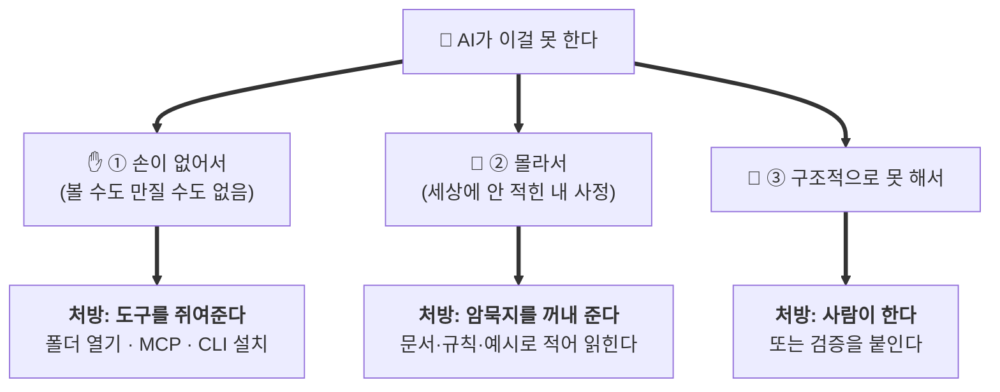
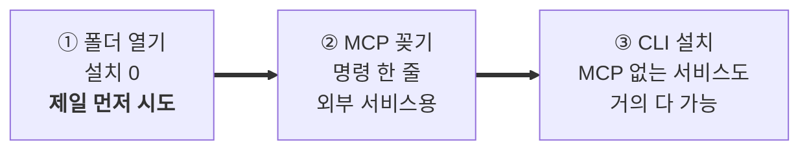

# AI가 못하는 것 — 무엇을 쥐여줄까

> **"AI는 이건 못 하네"라고 포기하기 전에 펴보는 표예요.**
> 못 하는 것처럼 보이는 일의 대부분은 **내가 뭔가를 안 줘서** 못 하는 거예요.

## 🎯 이 글에서 하는 일

AI가 못 하는 일을 만났을 때, **원인이 무엇이고 내가 뭘 주면 되는지** 판단할 수 있게 됩니다.

`⭐ 쉬움 · 🕐 필요할 때 찾아보기` · 💡 원리는 [[AI00-AI를-다루는-2축-암묵지-주입과-컨텍스트-관리]], 도구 설치 실습은 [[AI03-MCP와-서브에이전트로-워크플로-자동화]]

---

## "못 한다"는 세 종류예요 — 처방이 다릅니다



### 판별 질문 하나로 갈라져요

> **"세상 아무나 그 파일·화면을 열어보면 알 수 있는 일인가?"**
>
> - **예** → **①손 문제.** 정보가 어딘가 존재하는데 AI가 닿지 못하는 것. → **도구를 준다**
> - **아니오** → **②지식 문제.** 내 머릿속·우리 팀 안에만 있는 것. → **암묵지를 준다**

예를 들어 — "내 구글 시트 내용을 정리해줘"는 **①**이에요. 시트는 존재하고 사람은 열어볼 수 있으니까요.
"이 기능을 왜 그렇게 만들기로 했는지 반영해줘"는 **②**예요. 그건 어디에도 안 적혀 있어요.

---

## 상황별 처방표

### ✋ ① 손이 없어서 못 하는 것 → 도구를 준다

| AI가 못 하는 일 | 무엇을 주면 되나 |
|---|---|
| **내 구글 시트·문서를 읽기** | 구글 워크스페이스용 **명령줄 도구(CLI)** 를 깔아주기. 그러면 AI가 그걸 통해 읽어요 |
| 내 컴퓨터 파일·내 노트 읽기 | **그 폴더를 편집기에 열어주기.** 제일 쉬움 — 설치할 것 없어요 |
| 실제 브라우저로 내 사이트 확인 | **브라우저 MCP**(Playwright) |
| 내 앱 데이터베이스 조회 | **DB MCP**(Supabase 등) — 처음엔 **읽기 전용**으로 |
| 깃허브 이슈·PR 다루기 | **GitHub MCP** 또는 `gh` CLI |
| 노션·슬랙 내용 가져오기 | 각 서비스 **MCP** |
| 최신 라이브러리 문서 보기 | **문서 MCP**(Context7) 또는 웹 검색 도구 |
| 터미널 명령 실행 | 대부분 편집기에 **이미 있어요** (승인만 해주면 됨) |

> 💡 **핵심은 "AI가 터미널을 쓸 수 있으면, 설치된 CLI가 곧 AI의 손이 된다"예요.**
> 그래서 어떤 서비스든 **명령줄 도구가 있으면** AI가 다룰 수 있게 돼요. MCP가 없어도요.
> 구글 시트가 딱 이 경우예요 — 기본 상태의 AI는 못 읽지만, **CLI를 깔면 읽을 수 있게** 돼요.
> (어떤 도구를 어떻게 깔지는 **코치에게 물어보세요.** 설치는 코치가 대신 해요.)

### 🧠 ② 몰라서 못 하는 것 → 암묵지를 꺼내 준다

이건 **도구를 아무리 붙여도 해결되지 않아요.** 세상 어디에도 안 적혀 있으니까요.

| AI가 못 하는 일 | 무엇을 주면 되나 |
|---|---|
| 내 취향에 맞는 디자인 | **"내가 좋아하는/싫어하는 것"을 문서로.** 참고 사이트 3개도 함께 |
| 내 말투로 글쓰기 | 내가 쓴 글 3~6개 → **문체 가이드**로 뽑아 저장 |
| 우리 팀·우리 앱 용어 | **용어 사전 노트** (우리는 "회원"을 뭐라 부르나) |
| 지난번에 왜 그렇게 정했는지 | **결정 기록** — 무엇을 왜 그렇게 했는지 |
| 예전에 이렇게 하다 망한 것 | **실패 기록.** 없으면 AI가 같은 함정을 또 팝니다 |
| 지금 어디까지 만들었는지 | **진행 상태·작업로그 파일** |
| 이 앱을 누가 어떻게 쓰는지 | **PRD(요구사항 문서)** |

> 📌 **판단 기준:** 같은 설명을 **세 번** 했다면, 그건 대화가 아니라 **파일에 적을 내용**이에요.
> 방법은 → [[AI01-지식자산화-AI에게-줄-지식베이스-만들기]] · [[AI02-AI가-안-헤매게-규칙과-계획-고정하기]]

### 🚧 ③ 구조적으로 못 하는 것 → 사람이 한다

도구도 지식도 해결해 주지 않는 것들이에요. **알고 있는 것 자체가 실력**이에요.

| 못 하는 일 | 왜 | 그래서 |
|---|---|---|
| **틀렸는지 스스로 알기** | 확률로 그럴듯한 말을 잇는 구조라서 | **검증은 내 몫.** 화면에서 눌러보기 · 테스트 |
| 정확한 계산·글자 수 세기 | 계산기가 아니라 언어 모델이라서 | 계산은 **코드로 시켜라**("계산기 쓰지 말고 코드로") |
| 내가 안 말한 의도 알아내기 | 독심술은 없음 | **되묻게 시켜라** |
| "이게 사용자에게 좋은가" 판단 | 취향·맥락의 문제 | 내가 정함. AI는 후보를 냄 |
| 실제 세상에서 행동 (계약·결제) | 권한도 책임도 없음 | 사람이 함 |
| 대화를 기억하기 | 매 턴 다시 읽는 구조 | **파일로 남긴다** → [[AI00-AI를-다루는-2축-암묵지-주입과-컨텍스트-관리]] |

---

## 손을 쥐여주는 3가지 방법 (쉬운 순서)



1. **폴더 열기 (설치 필요 없음)** — 내 파일·내 노트는 **그 폴더를 편집기에 열기만** 하면 AI가 읽어요.
   많은 사람이 이걸 모르고 MCP를 찾습니다. **먼저 이걸 시도하세요.**
2. **MCP 꽂기** — 브라우저·노션·DB·깃허브처럼 **외부 서비스**용. 대개 명령 한 줄이고 코치가 대신 해요.
3. **CLI 설치** — MCP가 없는 서비스도 **명령줄 도구가 있으면** AI의 손이 돼요. 구글 시트가 이 경우.

> ⚠️ **도구를 줄 때 안전 3개** — 도구는 내 데이터를 읽고 실제로 행동할 수 있어요.
> ① **신뢰된 출처만** ② **처음엔 읽기 전용** 권한부터 ③ **실행 전에 물어보게(승인)** 두기.
> 자세히는 → [[AI03-MCP와-서브에이전트로-워크플로-자동화]] · [[제품03-안전하게-지키기-보안-체크리스트]]

---

## 🤖 코치에게 줄 프롬프트

**① 진단받기 — 가장 먼저 쓸 프롬프트**
```
[이 일]을 해달라고 했는데 잘 안 되네. 원인이 뭐야?
① 네가 볼 수 없어서(손·도구가 없어서)인지
② 내가 안 알려줘서(내 사정을 몰라서)인지
③ 원래 구조적으로 못 하는 일인지
셋 중 무엇인지 먼저 말하고, 그럼 내가 뭘 주면 되는지 알려줘.
```

**② 도구가 필요한 경우 — 설치까지 맡기기**
```
[이 서비스/데이터]를 네가 직접 다룰 수 있게 해줘.
- MCP가 있으면 MCP로, 없으면 명령줄 도구(CLI)로 — 어느 쪽이 나은지 먼저 알려줘.
- 설치 명령은 네가 대신 실행하고, 나는 뭘 승인하면 되는지만 알려줘.
- 권한은 처음엔 읽기 전용으로. 다 되면 실제로 읽어와서 잘 되는지 보여줘.
```

**③ 암묵지가 필요한 경우 — 나에게서 뽑아내게 시키기**
```
이 일을 잘하려면 네가 나에 대해 뭘 알아야 해? 질문 5개로 물어봐줘.
내가 답하면 그걸 파일로 정리해서, 앞으로 매번 읽을 수 있게 만들어줘.
```

**④ 내 도구 목록 점검**
```
지금 너한테 어떤 도구가 붙어 있어? 각각 뭘 할 수 있는지 쉬운 말로 목록으로 보여줘.
그리고 내가 자주 부탁하는 일들 중에 도구가 없어서 못 하고 있는 게 있으면 알려줘.
```

## ⚠️ 자주 하는 실수

- **"AI는 원래 이건 못 해"라고 단정.** 대부분 **도구가 없어서**예요. 먼저 ①/②/③ 진단부터.
- **파일 읽기에 MCP를 찾음.** 내 파일·내 노트는 **폴더만 열면** 읽혀요. 설치할 게 없어요.
- **도구를 붙였는데 여전히 일반론.** 그건 **②지식 문제**예요. 도구는 손이지 머리가 아니에요.
- **멋있어 보여서 MCP를 잔뜩 설치.** 도구가 읽어온 것도 **컨텍스트를 먹어요.** 필요한 것만.
  (왜 그런지 → [[AI00-AI를-다루는-2축-암묵지-주입과-컨텍스트-관리]]의 축2)
- **처음부터 쓰기·삭제 권한을 줌.** **읽기 전용부터.** 신뢰가 쌓인 뒤에 늘리세요.
- **설치 후 앱을 안 껐다 켬.** MCP가 안 붙는 이유의 90%예요. **완전 종료 → 재실행.**

## 관련

원리(왜 도구와 암묵지 둘뿐인가) → [[AI00-AI를-다루는-2축-암묵지-주입과-컨텍스트-관리]] ·
도구 설치 실습 → [[AI03-MCP와-서브에이전트로-워크플로-자동화]] ·
암묵지 꺼내기 → [[AI01-지식자산화-AI에게-줄-지식베이스-만들기]] ·
막힐 때 → [[자주-막히는것-FAQ]] · 모르는 단어 → [[용어집-비개발자용]]

> 🖼️ 이 문서의 그림은 mermaid예요. 깃허브 웹·Cursor 미리보기·옵시디언에서 **그림으로 보여요.**
