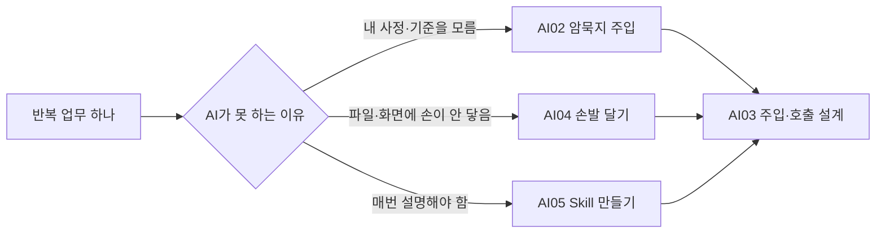

# AI00 — 내 일에서 자동화 후보 찾기

## 이 스텝에서 하는 일

AI에게 코드를 짜 달라고 하기 전에, **내가 매주 되풀이하는 일 하나**를 찾습니다. 코치는 업무를 대신 상상하지 않고 질문으로 꺼내며, 후보를 비교해 첫 실험 하나를 고릅니다.

`⭐ 쉬움 · 약 20분 · 코드 없음`

## 먼저 코치에게 내 일부터 보여주세요

아래 네 종류를 지난 일주일에서 하나씩 떠올립니다.

- 같은 내용을 여러 곳에 **복사해 옮긴 일**
- 자료를 찾아 **모으고 분류한 일**
- 비슷한 문서·메시지를 **반복해서 만든 일**
- 잊지 않으려고 사람이 **확인하고 알려준 일**

코치는 각 일에 대해 네 가지만 묻습니다.

1. 언제 시작되나요?
2. 무엇을 읽나요?
3. 어떤 결과가 나오면 끝인가요?
4. 틀리면 누가 얼마나 곤란한가요?

## 첫 자동화를 고르는 기준

| 좋은 첫 후보 | 아직 미룰 후보 |
| --- | --- |
| 주 2회 이상 반복한다 | 가끔 한 번 한다 |
| 입력과 결과의 모양이 비슷하다 | 매번 판단 기준이 완전히 다르다 |
| 틀려도 사람이 보고 고칠 수 있다 | 결제·삭제·외부 발송처럼 되돌리기 어렵다 |
| 10분 안에 결과를 눈으로 확인할 수 있다 | 성공 여부를 확인할 방법이 없다 |

점수는 `반복 빈도 × 귀찮음 × 확인 가능성`으로 생각합니다. 처음에는 완전 자동화보다 **AI가 초안을 만들고 사람이 확인하는 반자동화**가 좋습니다.

## 후보를 다음 모듈로 보냅니다



지식과 도구가 모두 필요한 일도 많습니다. 예를 들어 회의록 정리는 문서를 읽는 손도 필요하고, 우리 팀이 중요하게 보는 기준도 필요합니다.

## 코치에게 줄 말

```text
내가 지난 일주일에 한 일을 질문으로 하나씩 꺼내줘.
반복·복사·검색·정리·확인 업무를 찾고, 후보마다
① 시작 신호 ② 읽을 것 ③ 결과물 ④ 틀렸을 때 위험을 표로 정리해줘.
내가 답하지 않은 업무를 상상해서 채우지 말고, 첫 자동화 하나를 같이 고르자.
```

## 완료 기준

- 자동화 후보가 3개 이상 나왔습니다.
- 첫 실험 하나의 입력·결과·사람의 확인 지점이 한 문장씩 정해졌습니다.
- 필요한 것이 **내 지식인지, AI의 손발인지, 반복 절차인지** 구분됐습니다.

다음은 대개 [[AI01-지식베이스-깔고-AI와-연결하기]]입니다. 이미 지식베이스가 있다면 필요한 모듈로 바로 가도 됩니다.
