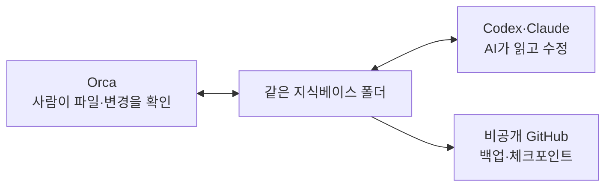

# AI01 — 지식베이스 깔고 AI와 연결하기

## 이 스텝에서 하는 일

공통 준비에서 설치한 Orca, Codex CLI 또는 Claude Code, GitHub 위에 **내 지식베이스를 설치**합니다. 폴더 구조를 공부하는 게 목표가 아니라, 내 기록 하나가 다음 답에 실제로 쓰이는 경험이 목표입니다.

`⭐ 쉬움 · 약 30분 · 설치와 명령은 코치가 처리`

## 왜 대화창이 아니라 지식베이스인가요?

대화는 끝나면 찾기 어렵고, 같은 설명을 다시 하게 됩니다. 지식베이스는 내 기준·경험·결정을 평범한 Markdown 파일로 남겨 **다른 AI와 새 대화에서도 다시 읽게 하는 공용 기억**입니다.


## 코치가 대신 해주는 설치

1. `02_템플릿/지식베이스-템플릿/`을 내 작업 폴더에 복사합니다.
2. AI가 먼저 읽는 규칙 파일과 `index.md`가 있는지 확인합니다.
3. 공통 준비에서 익힌 방식으로 **이 지식베이스용 비공개 GitHub 저장소**를 만들고 첫 체크포인트를 올립니다. 개인정보·비밀번호는 넣지 않습니다.
4. Orca의 **Add Repo**에서 같은 지식베이스 루트를 고르고 파일 목록의 `index.md`를 엽니다.
5. 저장소 옆 `+`에서 설치한 Codex 또는 Claude Code를 골라 실행합니다. **로컬 파일은 MCP 없이 작업 폴더만 연결하면 읽을 수 있습니다.**
6. `나에-대해.md`에 지금 필요한 사실 한 건만 적고 검색되는지 시험합니다.



처음에는 템플릿의 큰 폴더 세 개면 충분합니다. 자료가 쌓이기 전에 완벽한 분류 체계를 설계하지 않습니다. 같은 주제가 세 개 이상 쌓이고 실제로 못 찾겠을 때 [[지식베이스-폴더분류-어떻게-나눌까]]를 봅니다.

## 첫 연결 실험

1. AI가 모를 내 경험이나 선호 하나를 `나에-대해.md`에 적습니다.
2. 새 대화를 엽니다.
3. “내 지식베이스에서 관련 기록을 찾아 답하고, 어떤 파일을 썼는지 알려줘”라고 묻습니다.
4. 기록이 반영된 답과 일반적인 답이 어떻게 다른지 확인합니다.

## 코치에게 줄 말

```text
이 커리큘럼의 지식베이스 템플릿을 내 컴퓨터에 설치해줘.
명령과 Git 작업은 네가 대신 하고, 나는 폴더 위치와 기록할 내용만 정할게.
설치 뒤 내 경험 한 건을 기록하고 새 대화에서 다시 찾아 쓰는 것까지 실제로 확인해줘.
처음부터 폴더를 많이 만들지 말고 템플릿 그대로 시작해줘.
```

## 완료 기준

- 내 컴퓨터에 Markdown 지식베이스가 생겼습니다.
- Orca와 AI가 `index.md`가 있는 같은 루트 폴더를 바라봅니다.
- AI가 `index.md`에서 관련 문서를 찾아 읽습니다.
- 새 대화에서도 내 기록을 근거로 답하고, 사용한 파일을 알려줍니다.
- 비공개 원격 저장소에 첫 체크포인트가 올라갔습니다.

다음: [[AI02-AI가-모르는-암묵지-주입하기]] · 템플릿: [[지식베이스-스타터]]
