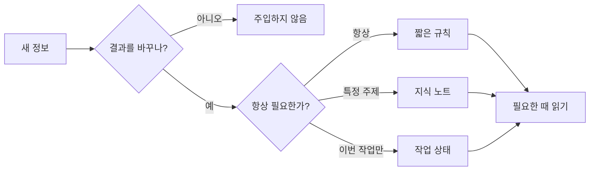

# AI03 — 주입할 것과 읽힐 때 설계하기

## 이 스텝에서 하는 일

정보를 발견할 때마다 세 가지를 정합니다. **AI에게 줄 것인가, 어디에 둘 것인가, 언제 읽힐 것인가.** 지식베이스를 통째로 먹이지 않고 지금 일에 필요한 문서만 작업대에 올리는 것이 목표입니다.

`⭐ 쉬움 · 약 30분 · 코드 없음`

## AI를 잘 쓰는 건 거의 파일 관리입니다

여기서 파일 관리는 폴더를 예쁘게 정리하는 일이 아닙니다. AI의 결과를 바꾸는 정보를 파일로 남기고, 필요 없는 정보는 빼고, 필요한 순간에만 찾아 읽히게 하는 **컨텍스트 관리**입니다.



## 정보마다 세 번 결정합니다

| 질문 | 선택 기준 |
| --- | --- |
| **주입할까?** | 이 정보가 다음 결과나 행동을 바꾸는가? 일반 상식·검색으로 다시 얻을 수 있는 원문·중복이면 넣지 않습니다. |
| **어디에 둘까?** | 매번 행동을 바꾸는 짧은 지시는 규칙, 다시 쓸 경험·결정은 지식 노트, 이번 작업의 위치는 상태 파일에 둡니다. |
| **언제 읽힐까?** | 항상 필요한 최소 규칙만 자동으로 읽고, 긴 지식은 index·summary로 찾은 뒤 해당 작업에서만 읽힙니다. |

“나중에 쓸지도 몰라”는 주입 기준이 아닙니다. 원문을 다시 찾을 수 있다면 링크와 결론만 남기고, 비슷한 설명이 이미 있다면 새 문서를 만들지 말고 현재 결론으로 합칩니다.

## 많이 주면 왜 오히려 흐려지나요?

AI가 한 번에 참고하는 공간은 책상과 같습니다. 좋은 문서라도 관계없는 것이 많이 올라오면 중요한 지시가 희석되고, 오래된 결정과 새 결정이 충돌합니다.

> **지식베이스는 창고이고 컨텍스트는 오늘의 작업대입니다.** 창고가 크다고 작업대에 전부 올리지 않습니다.

그래서 각 문서는 한 주제의 필요한 내용만 소유합니다. 규칙 파일에는 모든 지식을 몰아넣지 않고, 인덱스에는 전문을 복사하지 않고 “어디에 무엇이 있는지”만 둡니다.

## 대화가 길어졌을 때

1. 대화에서 확정된 **결정·이유·남은 일**을 먼저 맞는 파일에 반영합니다.
2. 같은 일을 계속하면 `compact`로 대화를 줄입니다.
3. 일이 바뀌었으면 새 대화를 열고 필요한 파일만 다시 읽힙니다.
4. compact 기능이 없다면 핵심 세 가지를 10줄 안으로 요약해 파일에 저장한 뒤 새 대화로 옮깁니다.

compact는 손실 압축이라 세부가 빠질 수 있습니다. **기억을 대화에 맡기지 않고 파일에 남기는 것이 먼저**입니다.

## 실습

[[AI00-내-일에서-자동화-후보-찾기]]에서 고른 업무 하나에 필요한 정보를 모읍니다. 각 항목에 `주입 / 제외`, `규칙 / 지식 / 상태`, `항상 / 이 주제 / 이번 작업`을 표시합니다. 그 뒤 AI에게 전체 폴더와 선별한 문서 1~3개를 각각 읽혀 답의 구체성·충돌·근거를 비교합니다.

## 코치에게 줄 말

```text
[이 업무]에 쓸 정보를 함께 정리해줘.
각 정보마다 ① 결과를 바꾸므로 주입할지 ② 규칙·지식·작업 상태 중 어디에 둘지
③ 항상·이 주제·이번 작업 중 언제 읽힐지를 판단해줘.
내 지식베이스 전체를 읽지 말고 index와 summary로 후보를 찾은 뒤 필요한 문서 1~3개만 읽어줘.
대화가 길어졌다면 결정·이유·남은 일을 파일에 먼저 반영하고 compact나 새 대화를 추천해줘.
```

## 완료 기준

- 정보 하나를 보고 **넣을지 말지** 이유를 말할 수 있습니다.
- 규칙·지식 노트·작업 상태를 구분합니다.
- AI가 작업 전에 읽을 문서와 제외할 범위를 말합니다.
- compact나 새 대화 전에 중요한 결정이 파일에 남습니다.
- 전체 자료보다 선별한 자료가 왜 나은지 사용한 근거로 설명할 수 있습니다.

다음: [[AI04-AI에게-도구로-손발-달아주기]] · 반복 절차라면 [[AI05-반복작업을-Skill로-만들기]]
