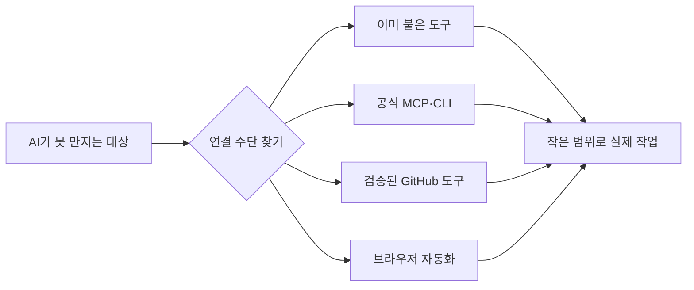
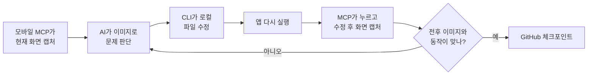

> 원문: [OpenAI Codex MCP](https://developers.openai.com/codex/mcp/) · [Codex Cloud](https://developers.openai.com/codex/cloud/) · [Codex Remote](https://learn.chatgpt.com/codex/remote) · [Claude Code Remote Control](https://code.claude.com/docs/en/remote-control) · [Claude Code on the web](https://code.claude.com/docs/en/claude-code-on-the-web) · [Mobile MCP](https://github.com/mobile-next/mobile-mcp) · [Maestro MCP](https://docs.maestro.dev/get-started/maestro-mcp) · [Maestro CLI 설치](https://docs.maestro.dev/maestro-cli/how-to-install-maestro-cli) · [Playwright MCP](https://github.com/microsoft/playwright-mcp) · [GitHub 공식 MCP](https://github.com/github/github-mcp-server) · [Figma 공식 MCP](https://help.figma.com/hc/en-us/articles/32132100833559-Guide-to-the-Figma-MCP-server)
> 수집: 2026-09-14 · 확인 범위: 클라우드·로컬 실행 차이, 지원 환경, 제공 기능, Codex·Claude 연결 명령, 최근 유지보수 여부

# AI04 — AI에게 도구로 손발 달아주기

## 이 스텝에서 하는 일

AI가 말만 하는 상자에서 벗어나 **내 파일·모바일 시뮬레이터·브라우저·업무 서비스에 직접 닿게** 합니다. 기본 스텝에서 CLI라는 첫 손을 붙였으니, 이제 [[AI00-내-일에서-자동화-후보-찾기]]의 업무에 필요한 외부 도구 하나를 AI가 직접 찾아 설치하고 실제 작업으로 검증합니다.

`⭐⭐ 보통 · 약 40분 · 검색·설치·설정은 코치가 처리`

## 먼저 손 문제인지 확인합니다

> 세상 아무나 그 파일이나 화면을 열어 보면 알 수 있는 일인가요?

- **예:** 정보는 있는데 AI가 닿지 못하는 손 문제 → 도구를 연결합니다.
- **아니오:** 내 머릿속에만 있는 지식 문제 → [[AI02-AI가-모르는-암묵지-주입하기]]로 갑니다.

도구를 달아도 AI가 내 취향이나 결정 이유를 저절로 알게 되지는 않습니다. **손과 지식은 서로 다른 문제**입니다.

## 이제 대부분의 일에는 연결할 길이 있습니다

외부 서비스가 API(다른 프로그램이 드나드는 문)를 공개했다면 대개 MCP나 CLI가 있고, 둘 다 없으면 브라우저 자동화로 화면을 직접 조작할 수 있습니다. 그래서 자료를 사람이 매번 복사해 붙이기 전에 **AI에게 접근 수단부터 찾아 붙이라고** 합니다.



단, **별이 제일 많은 저장소를 무조건 설치하지는 않습니다.** 설치하는 순간 그 프로그램도 내 파일과 계정에 닿을 수 있기 때문입니다. 그때그때 AI가 아래 순서로 비교하게 합니다.

1. 지금 AI에 이미 붙어 있는 도구
2. 서비스 회사가 직접 만든 공식 MCP·CLI
3. 내 운영체제와 정확한 작업을 지원하는지
4. 최근에도 업데이트되는지, 사용자가 충분한지
5. 요구하는 권한과 설치 범위가 작은지

## 화면과 디자인은 이미지가 기준입니다

색·간격·정렬·잘림·시각적 위계처럼 **눈으로 판정하는 문제는 JSON이나 글 설명으로 끝내지 말고 반드시 현재 화면 이미지를 AI에게 보여줍니다.** “버튼의 `x`가 20이다”라는 데이터만으로는 버튼이 답답한지, 글자가 잘렸는지, 전체 균형이 어색한지 알 수 없습니다.

화면 구조 데이터와 이미지는 경쟁 관계가 아니라 역할이 다릅니다.

| AI에게 주는 것 | 잘하는 일 |
| --- | --- |
| **스크린샷·화면 녹화** | 디자인 판단, 깨짐·잘림·겹침 발견, 수정 전후 비교 |
| **접근성 트리·DOM·JSON** | 버튼 이름과 좌표 찾기, 정확히 누르기, 값 읽기, 자동 검증 |

따라서 화면 작업의 기본은 **이미지로 보고 → 구조 데이터로 정확히 누르고 → 다시 이미지로 확인하기**입니다. Figma 링크나 디자인 JSON을 줬더라도 마지막에는 렌더링된 프레임이나 실제 앱 스크린샷을 받습니다.

## 예시 — 모바일 시뮬레이터를 AI가 직접 보게 하기

모바일 도구만 붙인다고 소스가 저절로 바뀌는 것은 아닙니다. **Codex·Claude CLI가 로컬 파일을 고치고, 모바일 MCP가 시뮬레이터에서 눈과 손 역할**을 합니다.



### 무엇을 추천하나요?

| 상황 | 추천 | 이유 |
| --- | --- | --- |
| 지금 켜진 iOS·Android 화면을 AI가 보고 누르고 캡처하게 만들기 | **Mobile MCP** | 한 연결로 기기 찾기·앱 실행·탭·스크롤·입력·스크린샷·화면 녹화·로그 확인을 지원 |
| 같은 가입·구매·저장 흐름을 다음에도 반복 검증하기 | **Maestro CLI + MCP** | AI가 실기기를 조작하고, 성공한 순서를 사람이 읽을 수 있는 테스트 흐름으로 남길 수 있음 |
| 설치를 최소화해 캡처만 하기 | 맥 `xcrun simctl`, 안드로이드 `adb` | 운영체제 기본 도구로 캡처·앱 실행 같은 작은 작업부터 가능 |

첫 실습은 **Mobile MCP 하나**로 충분합니다. 같은 조작이 세 번 반복되면 Maestro 흐름이나 [[AI05-반복작업을-Skill로-만들기|Skill]]로 고정합니다. Appium도 유명하고 강력하지만 드라이버와 설정 범위가 커서 첫 연결보다 복잡한 테스트 환경이 필요해진 뒤에 고릅니다.

### 맥북 — iPhone 시뮬레이터 또는 Android 에뮬레이터

먼저 iPhone이면 Xcode에서 Simulator를, Android면 Android Studio에서 Emulator를 하나 켭니다. 아래에서 **내가 쓰는 AI 명령 하나만** 실행합니다. `npx`가 없으면 코치에게 Node.js 최신 안정 버전을 공식 경로로 먼저 설치해 달라고 합니다.

Codex를 쓴다면:

```bash
codex mcp add mobile-mcp -- npx -y @mobilenext/mobile-mcp@latest
codex mcp list
```

Claude Code를 쓴다면:

```bash
claude mcp add mobile-mcp -- npx -y @mobilenext/mobile-mcp@latest
claude mcp list
```

### 윈도우 — Android 에뮬레이터

윈도우에서는 Android Studio의 Emulator를 켭니다. **iPhone 시뮬레이터는 macOS의 Xcode에서만 실행**할 수 있으므로 윈도우에서는 Android로 실습합니다. PowerShell에서 아래 중 내가 쓰는 AI 명령 하나만 실행합니다.

Codex를 쓴다면:

```powershell
codex mcp add mobile-mcp -- npx -y @mobilenext/mobile-mcp@latest
codex mcp list
```

Claude Code를 쓴다면:

```powershell
claude mcp add mobile-mcp -- npx -y @mobilenext/mobile-mcp@latest
claude mcp list
```

설치 뒤 AI를 완전히 종료하고 다시 시작합니다. 명령이 바뀌었거나 연결에 실패하면 외우거나 검색 결과를 임의로 복사하지 말고, 코치에게 위 **공식 저장소의 최신 설치법을 확인해 대신 처리**하게 합니다.

### 모바일 수정 루프를 통째로 맡기는 말

```text
지금 켜진 iOS Simulator 또는 Android Emulator를 직접 확인해줘.
먼저 현재 화면을 이미지로 캡처하고, 화면 구조 데이터는 누를 요소를 찾는 보조 자료로만 써줘.

[고치고 싶은 점]을 확인한 뒤:
1. 수정 전 스크린샷 저장
2. 관련 로컬 파일만 수정
3. 앱 다시 실행
4. 실제 화면에서 눌러보기
5. 수정 후 스크린샷 저장
6. 두 이미지를 비교해 디자인과 동작이 맞는지 보고
까지 반복해줘.

실제 사용자 계정·결제·외부 발송·삭제가 필요하면 그 직전에 멈춰서 물어봐.
```

## 다른 손발도 같은 방식으로 붙입니다

| 맡기고 싶은 일 | 먼저 찾아볼 도구 | AI가 할 수 있는 예 |
| --- | --- | --- |
| 웹사이트 확인 | **Playwright MCP 또는 CLI** | 브라우저 열기·클릭·스크린샷·콘솔 오류 확인 |
| GitHub 원격 작업 | 기본 `git`·`gh` CLI, 더 필요하면 **GitHub 공식 MCP** | 이슈·PR·액션 상태 읽기와 관리 |
| Figma 디자인 | **Figma 공식 MCP** | 프레임·컴포넌트·변수 읽기, 지원 범위 안에서 캔버스 수정 |
| 데이터베이스 | 서비스의 공식 CLI·MCP | 스키마 확인·조회·마이그레이션. 처음에는 읽기 전용 |
| 영상·이미지 파일 | `ffmpeg`·ImageMagick 같은 검증된 CLI | 자르기·압축·형식 변환·썸네일 생성 |
| 휴대폰에서 내 지식베이스와 대화 | **공식 클라우드 실행 우선**, 필요하면 개인 Slack 봇 | 노트북 없이 원격 저장소에서 일하거나, 켜진 내 컴퓨터의 로컬 지식베이스를 Slack으로 조작 |
| 회사 문서·메신저 | 서비스의 공식 MCP·앱·API | 필요한 문서 검색·요약. 외부 발송은 승인 뒤 실행 |

도구 이름을 전부 외울 필요는 없습니다. **하려는 일을 말하고, AI가 현재 가장 맞는 손을 찾아 붙이게 하는 법**만 알면 됩니다.

### 휴대폰에서 개인 AI 비서 쓰기 — 먼저 실행 장소를 고릅니다

휴대폰에서 쓴다는 말만으로는 부족합니다. **AI가 어디서 실행되고, 어느 파일을 보는지**가 핵심입니다.

| 방식 | 노트북에서 먼저 세션을 열어야 하나? | 실제로 보는 파일 | 언제 고르나 |
| --- | --- | --- | --- |
| **Codex Cloud** | 아니오 | GitHub·GitLab에 올라간 저장소를 클라우드 환경에 받아서 봄 | 노트북을 켜지 않고 Codex 웹의 클라우드 작업을 시작하고 싶을 때 |
| **Codex Remote** | 로컬 세션을 미리 열 필요는 없지만, **연결한 PC가 깨어 있고 온라인이어야 함** | 연결한 PC의 로컬 프로젝트 | ChatGPT 모바일 앱에서 내 PC의 Codex를 조종할 때 |
| **Claude Code on the web** | 아니오 | 연결한 GitHub 저장소를 클라우드 환경에서 봄 | 노트북 없이 Claude 모바일 앱에서 시작·확인하고 싶을 때 |
| **Claude Code Remote Control** | **예.** 로컬 세션과 노트북이 실행 중이어야 함 | 내 노트북의 최신 파일·로컬 MCP·도구 | 클라우드에 안 올린 파일과 내 컴퓨터 도구가 필요할 때 |
| **이 템플릿의 개인 Slack 봇** | AI 대화 세션을 미리 열 필요는 없지만, **봇 프로그램과 노트북은 켜져 있어야 함** | 내 노트북의 지식베이스 | Slack 스레드 UI·나만의 명령·추가 자동화를 원할 때 |

따라서 **비공개 GitHub에 지식베이스가 최신 상태로 올라가 있고, 휴대폰에서 클라우드 작업을 시작할 수 있다면 공식 Codex·Claude 화면이 1순위**입니다. 별도 봇을 만들 이유가 없습니다. 다만 이름에 `Remote`나 `Remote Control`이 붙은 방식은 휴대폰이 창문일 뿐 실제 작업은 내 PC에서 돌아갑니다. 클라우드는 노트북에만 있고 아직 `push`하지 않은 변경을 볼 수 없으므로, 시작 전 최신 체크포인트를 GitHub에 올렸는지도 확인합니다. 클라우드가 만든 변경도 결과를 원격 저장소에 반영한 뒤, 다음에 노트북을 열면 `pull`해서 받아와야 합니다. GitHub는 자동 동기화가 아닙니다.

Slack 봇은 더 단순해서가 아니라 **Slack 스레드를 개인 비서의 고정 입구로 쓰거나, 나중에 정해진 자동화·Skill을 한 메시지로 실행하고 싶을 때** 고릅니다. Slack 앱이 로컬 봇에 연결된 구성이라면 노트북이 잠들면 멈추고, 24시간 쓰려면 봇과 지식베이스를 항상 켜진 별도 컴퓨터나 서버로 옮겨야 합니다.

지식베이스 템플릿에는 [[개인지식베이스를-바라보는-슬랙봇-빌드키트]]가 함께 들어 있습니다. 이 봇은 질문에 답하기만 하는 읽기 전용 봇이 아니라, 사용자가 “이 결정을 기록해줘”라고 명확히 요청하면 **지식베이스 안의 노트도 만들고 고치는 개인 AI 비서**입니다. 삭제·외부 발송·공개처럼 되돌리기 어려운 일은 확인 뒤에만 합니다.

```text
내 지식베이스 템플릿에 있는 개인지식베이스를-바라보는-슬랙봇-빌드키트.md를 끝까지 읽고,
먼저 Codex·Claude의 모바일 클라우드만으로 내 요구가 해결되는지 판단해줘.
해결되지 않고 Slack이 필요한 이유가 분명하면, 내 개인 Slack 공간에
이 지식베이스를 읽고 명시적으로 요청한 기록은 수정하는 개인 AI 비서를 실제로 만들어 검증해줘.
로그인·2단계 인증·앱 설치 승인 때만 나에게 한 가지씩 요청하고,
토큰은 채팅에 쓰지 말고 .env에만 저장해줘.
```

## GitHub에서 현재 가장 적합한 도구까지 찾아 맡기는 말

```text
[대상 서비스/기기]에 접근해서 [하려는 일]을 네가 끝까지 처리할 수 있게 손발을 붙여줘.

1. 지금 이미 쓸 수 있는 내장 도구부터 확인해.
2. 없으면 공식 MCP나 공식 CLI를 먼저 찾아.
3. 공식 도구가 없으면 GitHub에서 지금 가장 널리 쓰이고 최근에도 관리되는 후보 3개를 찾아.
4. 별 개수만 보지 말고 공식성, 최근 업데이트·릴리스, 내 운영체제와 작업 지원,
   요구 권한, 공개된 보안 문제를 비교해 가장 작은 도구 하나를 골라.
5. 왜 골랐는지와 필요한 권한을 쉬운 말로 알려주고 설치·설정·재시작·연결 시험은 네가 해.
6. 테스트 계정이나 작은 샘플에서 먼저 성공시킨 뒤 [하려는 일]을 실제로 수행하고 결과 증거를 보여줘.

읽기와 로컬 테스트는 계속 진행해도 돼.
비밀번호 입력, 권한 확대, 실제 계정 변경, 외부 발송, 결제, 공개, 삭제 직전에만 멈춰서 물어봐.
```

검색 결과는 계속 바뀝니다. 이 문서의 도구 이름을 영원한 정답으로 외우는 것이 아니라 **실행하는 날 다시 비교**하게 하는 것이 핵심입니다.

## 연결 순서

1. 코치에게 현재 붙어 있는 도구와 권한을 보여 달라고 합니다.
2. 실제 업무 하나에 필요한 도구 하나만 고릅니다.
3. 공식성·최근 유지보수·지원 환경·권한을 확인합니다.
4. 처음에는 **읽기 전용·시뮬레이터·테스트 계정**으로 연결합니다.
5. 실제 업무의 작은 범위를 AI가 직접 수행하고, 화면 작업이면 수정 전후 이미지를 받습니다.
6. 도구가 가져온 자료도 컨텍스트를 차지하므로 [[AI03-주입할-것과-읽힐-때-설계하기]]의 기준으로 필요한 결과만 남깁니다.
7. 성공한 절차가 반복되면 [[AI05-반복작업을-Skill로-만들기]]로 넘깁니다.

## 완료 기준

- AI가 실제 파일·모바일 화면·브라우저·서비스 중 하나를 직접 읽거나 조작했습니다.
- 화면 작업이라면 JSON 설명이 아니라 **수정 전후 이미지**로 결과를 확인했습니다.
- 연결한 이유와 권한 범위를 내가 설명할 수 있습니다.
- 쓰기·삭제·결제·외부 발송에는 사람 승인선이 있습니다.
- 필요 없는 도구를 여러 개 한꺼번에 설치하지 않았습니다.

다음: 같은 절차를 되풀이한다면 [[AI05-반복작업을-Skill로-만들기]] · 진단표: [[AI가-못하는-것-무엇을-쥐여줄까]]
