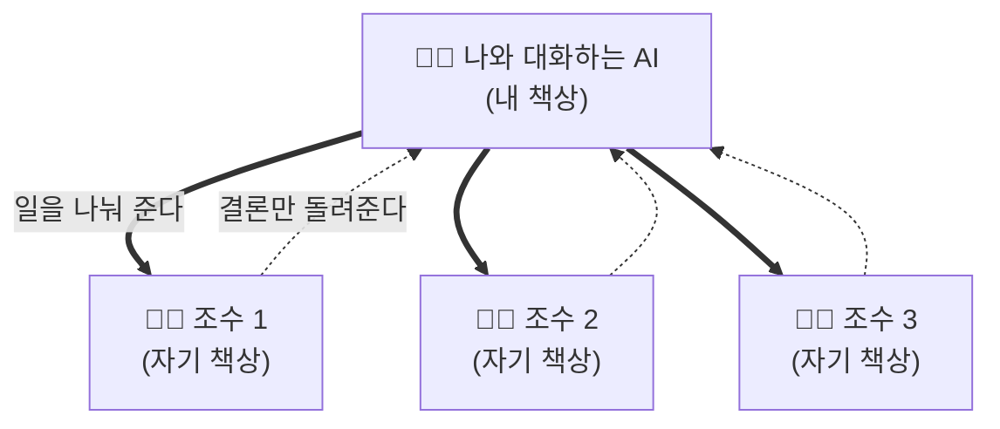
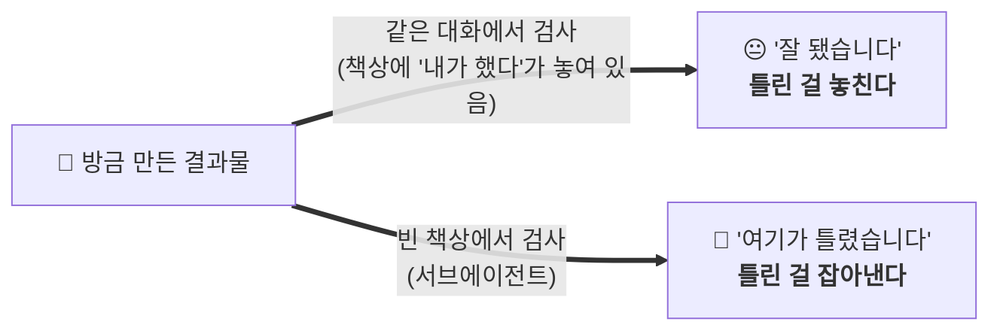

# AI03 — MCP·서브에이전트로 워크플로 자동화

## 🎯 이 스텝에서 하는 일
AI에게 **손·팀·매뉴얼·반사신경**을 달아서, "상자 속 챗봇"을 **내 도구·데이터에 꽂힌 조수**로 만듭니다.

`⭐⭐⭐ 어려움 · 🕐 약 40분` · AI를 더 깊게 파려는 사람용

💡 이 모듈은 [[AI00-AI를-다루는-2축-암묵지-주입과-컨텍스트-관리]]의 **두 축을 자동화하는 수단**이에요 —
MCP·CLI는 **주입(축1)과 선별(축2)을 사람 손 대신** 하게 하고, 서브에이전트는 **책상을 하나 더 써서** 축2를 아낍니다.

## 🔔 이 모듈이 필요한 신호

- AI가 **내 사이트·GitHub·DB 같은 걸 직접 못 봐서** 답답하다("네가 좀 열어서 확인해줬으면").
- 여러 가지를 **한 번에 병렬로** 조사·처리하고 싶다.
- AI에게 **더 강한 도구·자동화**를 쥐여주고 싶다.

## 왜 이렇게 하나

지금까지 AI는 **상자 속 챗봇**이었어요. 말은 잘 알아듣지만, 내 실제 파일·사이트·데이터엔 손이 안 닿았죠. 여기에 네 가지를 달면 달라져요.

| 개념 | 쉬운 뜻 | 비유 |
|---|---|---|
| **MCP** | AI에게 **네이티브로는 못 하는 손**을 달아줌 (브라우저·GitHub·DB 같은 외부 서비스) | AI용 USB-C 포트 |
| **서브에이전트** | 일의 일부를 **전문 조수 AI에게 위임** | 리드에게 보고하는 인턴 팀 |
| **Skill(스킬)** | AI가 필요할 때 꺼내 읽는 **반복 작업 매뉴얼** | 신입 온보딩 문서 |
| **Hook(훅)** | 특정 상황마다 **자동으로 실행되는 규칙** | 반사신경·집안 규칙 |

### 서브에이전트가 왜 강한가 — "책상을 하나 더 쓰는 것"

[[AI00-AI를-다루는-2축-암묵지-주입과-컨텍스트-관리]]에서 **컨텍스트를 책상**에 비유했죠.
서브에이전트는 한 마디로 **일을 시킬 때 책상을 하나 더 꺼내 쓰는 것**이에요. 여기서 이득이 셋 나와요.



| 이득 | 어느 축의 이야기 | 무슨 뜻 |
|---|---|---|
| **① 내 책상이 안 더러워진다** | **축2 (컨텍스트 관리)** | 조사하느라 파일 50개를 읽어도 그건 **조수 책상**에 쌓여요. 내 책상엔 **결론 몇 줄만** 와요 |
| **② 자기 말에 동의하지 않는다** | **축2 + 안전선** | 아래에서 자세히 — 검증에서 결정적이에요 |
| **③ 동시에 여러 개** | 실행 효율 | 조수 셋이 각자 조사하고 표 하나로 합쳐 와요 |

**①이 특히 큰 이득이에요.** "이 라이브러리 3개 비교해줘" 같은 일을 직접 시키면 문서를 잔뜩 읽어서
**내 책상이 순식간에 차버려요.** 그러면 앞서 정한 규칙이 밀려나고 AI가 헤매기 시작하죠.
조수에게 시키면 **읽는 건 조수 책상에서, 나는 결론만** 받아요.

### ⭐ ②가 왜 중요한가 — 자기가 한 일을 자기가 검사하면 안 돼요

AI에게 **"방금 네가 만든 거 제대로 됐는지 검사해봐"**라고 하면 대체로 **"잘 됐습니다"**라고 해요.
게을러서가 아니라 **구조 때문**이에요.



> **자기긍정은 성격이 아니라 컨텍스트 오염이에요.**
> 책상에 "내가 방금 이렇게 했다"가 놓여 있으면, AI는 **그 흐름에 이어지는 말**을 잇게 돼요.
> 그게 확률로 말을 잇는 구조(전제②)의 자연스러운 결과예요.

그래서 **검증은 빈 책상에서 시켜야** 해요. 서브에이전트가 정확히 그걸 해줘요.

> 💡 이건 [[05_만드는-순서-요구사항-테스트-코드-검증]]에서 본 것과 **완전히 같은 구조**예요 —
> **테스트를 코드 다음에 쓰면 코드에 동의만 하게 되는 것**과, **자기가 자기를 검사하면 자기에게 동의하는 것.**
> 둘 다 "**먼저 본 것에 동의하는 편향**"이고, 해법도 같아요 — **먼저 보지 않은 쪽에게 판정을 맡기기.**

핵심은 **당신이 뭘 만드는 게 아니라 "꽂는" 것**이에요. 이미 만들어진 커넥터가 수천 개라, 대개 **명령 한 줄**로 붙어요(코치가 대신 해줘요). 그리고 MCP는 2024년 앤트로픽이 만들어 **2025년 리눅스 재단에 기증한 공개 표준**이라, Cursor·Claude Code·Antigravity 어디서든 똑같이 써요.

## 이렇게 하세요

> ⚠️ **먼저 오해 풀기 — 파일 읽기엔 MCP가 필요 없어요.** Cursor·Claude Code·Antigravity에 폴더를 열어두면, 그 안의 파일(내 코드·내 노트 볼트)은 **MCP 없이도 AI가 그냥 읽어요**(네이티브 기능). 지식 볼트를 AI에 읽히고 싶으면 **그 폴더를 열기만** 하면 돼요.
> **MCP는 AI가 *스스로는 못 하는 일*에만** 써요 — **브라우저를 직접 열기**, **GitHub·DB·라이브 문서 같은 외부 서비스** 다루기.

**브라우저 하나부터 시작해요.** 나머지는 나중에.

1. **진짜 브라우저를 쥐여주기 (Playwright MCP) — 첫 승리.** AI가 실제 브라우저를 열어 내 사이트를 **직접 보고 점검**해요. 네이티브로는 못 하던 일이라 "손이 생겼다"가 확 와닿아요.
2. **설치 후 앱을 완전히 껐다 켜요.** (새로고침 말고 완전 종료 → 재실행. 이걸 안 해서 90%가 "왜 안 되지" 함.)
3. **서브에이전트는 설정 없이 바로.** "이 3가지 병렬로 조사해서 표로 줘"라고 하면 조수 여럿이 동시에 일해요.
4. **더 필요하면 외부 서비스 MCP.** 내가 실제로 쓰는 것만 — 예: **GitHub**(이슈·PR), **Supabase**(내 앱 DB를 평문으로 질문), **Context7**(최신 문서로 환각 줄이기). 코치가 붙여줘요.
5. **(선택) Skill 하나·Hook 하나.** 반복하는 워크플로는 Skill로, 위험 명령 차단(`rm -rf`)은 Hook으로. 코치가 만들어줘요.

> 💡 **배우는 순서:** Skill(제일 쉬움) → MCP(능력 도약) → Hook(안전) → 서브에이전트(확장). 이 모듈은 MCP 2개 + 서브에이전트 체험까지가 목표예요.

## 🤖 AI(코치)에게 줄 프롬프트

**셋업(코치가 실행):**
```
내 AI에 Playwright MCP(진짜 브라우저)를 붙여줘. 설치 명령을 네가 대신 실행하고,
설치 후 "앱을 완전히 껐다 켜야 한다"는 것도 알려줘. 다 되면 목록으로 확인시켜줘.
```

**첫 승리 3개(붙인 뒤 시켜보기):**
```
① (브라우저) [내 앱 주소]를 브라우저로 열어 스크린샷 찍고, 이상한 데 있으면 알려줘. 모바일 크기로도 봐줘.
② (서브에이전트·병렬) 이 3가지를 서브에이전트로 병렬 조사해서 한 표로 비교해줘: [A] · [B] · [C]. (설정 필요 없음)
   조사한 내용을 다 붙이지 말고 결론만 내 화면에 줘 — 내 대화창은 깨끗하게 두고 싶어.
③ (내 노트 — MCP 없이) 내 지식 볼트 폴더를 이 창에 열고: 내 노트에서 [주제]에 대해 쓴 걸 다 찾아 요약해줘.
④ (독립 검증 — 자기긍정 방지) 방금 만든 걸 서브에이전트에게 검사시켜줘. 네가 직접 판정하지 말고,
   앞뒤 사정을 모르는 조수에게 결과물만 주고 "요구사항대로 됐는지, 뭐가 깨졌는지" 찾아오게 해.
   너는 그 조수 보고를 나에게 그대로 전달만 해줘.
```

## ✅ 여기까지 하면 이렇게 보여요

- AI가 실제로 **브라우저를 열어 내 사이트를 점검**해요(네이티브로는 안 되던 일).
- 서브에이전트로 **병렬 조사 결과가 한 표**로 정리돼 나와요.
- **안 되면:** 대개 ① JSON 오타(코치에게 점검 요청) ② 앱을 완전히 안 껐다 켬. → [[스텝08-막혔을때-에러-읽고-디버깅]]

> 코치는 브라우저 MCP 연결 + 첫 승리 1개가 확인되면 `진행상태.md`의 이 모듈을 `- [x]`로, `상태.json`을 갱신합니다.

## ⚠️ 자주 하는 실수 (특히 보안 — 중요)

- **아무 MCP나 설치.** MCP는 내 데이터를 읽고 행동할 수 있어요. **신뢰된 공식/유명 출처만**(앤트로픽 공식 `@modelcontextprotocol/*`, Supabase 등). 낯선 GitHub MCP는 낯선 브라우저 확장처럼 취급.
- **너무 넓은 권한을 주기.** DB·GitHub 같은 걸 붙일 땐 **필요한 범위만**(처음엔 읽기 전용). 쓰기·삭제 권한은 신뢰가 쌓인 뒤에.
- **자동 실행 켜두기.** AI가 행동하기 전에 **물어보게(approve)** 두고 내용을 읽으세요. 위험 명령은 Hook으로 차단.
- **프롬프트 인젝션 방심.** AI가 읽은 웹페이지·파일에 "숨은 지시"가 있을 수 있어요(가장 흔한 위험). 민감한 작업엔 특히 조심. → [[제품03-안전하게-지키기-보안-체크리스트]]
- **서브에이전트 남발.** 3~5개가 적정. 그 이상은 결과 합치는 데 더 든다(+비용이 배로).
- **자기가 만든 걸 자기가 검사하게 함.** "잘 됐습니다"가 나와요. **검증은 빈 책상(서브에이전트)에게** 맡기세요.
- **조수가 읽어온 걸 전부 내 화면에 쏟게 함.** 그러면 컨텍스트를 아낀 의미가 없어요. **결론만 받으세요.**
- **"멋있어 보여서" 설치.** 뭘 왜 붙이는지 설명 못 하면 아직 붙이지 마세요. 프롬프트부터 익히는 게 먼저예요.

## 다음 스텝

권장 다음: [[AI04-코드-읽고-AI-졸업하기]] (AI를 깊게 부렸으면, 이제 그 결과물을 읽고 판단하는 성숙 단계)
관련: [[AI01-지식자산화-AI에게-줄-지식베이스-만들기]] (내 지식베이스 — 폴더로 열면 MCP 없이 읽힘) · [[AI02-AI가-안-헤매게-규칙과-계획-고정하기]] · [[제품03-안전하게-지키기-보안-체크리스트]] · 심화 지도(../_index.md)
MCP·에이전트가 무엇의 이름인지 → [[AI00-AI를-다루는-2축-암묵지-주입과-컨텍스트-관리]]. **이건 새로운 축이 아니라 두 축의 자동화 수단**이에요 — 내 자료를 AI가 직접 읽는 건 **축1(주입)의 자동화**, 필요한 파일만 골라 읽는 건 **축2(관리)의 자동화**. 도구가 읽어 온 것도 결국 **책상을 먹는다**는 점을 같이 기억하세요.

관련 참고: [[용어집-비개발자용]] · [[자주-막히는것-FAQ]]
