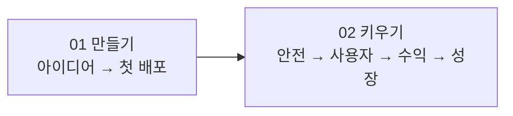

# 프로덕트 스텝 — 만들기부터 키우기까지

> **결과:** 아이디어를 링크로 공유되는 웹앱으로 만들고, 필요할 때 실제 서비스에 필요한 안전·수익·성장 장치를 붙입니다.

## 두 구간

| 구간 | 언제 | 진행 방식 |
| --- | --- | --- |
| [01_만들기](01_만들기/_index.md) | 아직 공유할 웹앱이 없을 때 | 준비부터 회고까지 13단계를 순서대로 진행 |
| [02_키우기](02_키우기/_index.md) | 첫 배포 뒤 실제 사용자·돈·안전이 걸릴 때 | 현재 문제에 필요한 9개 모듈 중 선택 |

코딩과 무관하게 AI로 내 반복 업무를 줄이고 싶다면 [AI 스텝](../04_AI_스텝/_index.md)으로 갑니다. AI 스텝과 프로덕트 스텝은 상급·하급이 아니라 결과가 다른 독립 트랙입니다.
